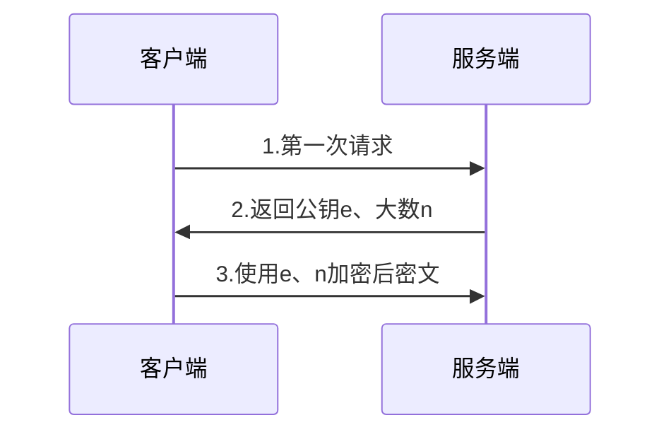
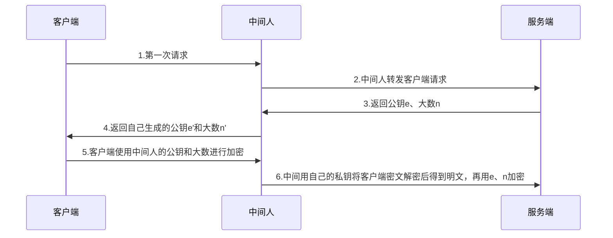
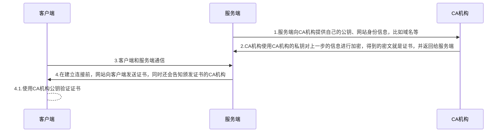

<!--more-->

## Http 和 Https

我们都知道 https 比 http 更加安全，主要是因为 https 的数据传输比 http 更加安全，所以 https 中的 s 其实是 Secure 的意思。

可理解为 http 是明文传输，而 https 是加密传输，所以更加安全。

## 为什么需要加密？

在网络世界中，存在着黑客，他们盗取用户的信息，进而做一些非法的行为，如果传输的数据不进行加密，说不定你在某个网站上输入的密码就会不知不觉中落入黑客手中。

## 对称加密

在早期的网络世界中，使用的都是对称加密。

比如客户端要将一个数字 M 传送给服务端，为了防止黑客抓包后知道传输的内容，客户端和服务端约定了一个秘钥 key，所以就引入了一个加密函数 f1(key, M)，客户端发送数字 M 时，通过 f1(key, M) 将 M 转换成密文 S，网络中传输的是密文 S，服务端拿到密文 S 之后，使用一个 f2(key, S) 函数，就能得到原文 M。

但是，存在一个问题，这个 key 要怎么做到两边统一？

如果不管哪个客户端的 key 都是一样的，那肯定不安全，因为如果黑客破解了一个客户端的 key，就破解了整个服务，所以每个客户端的 key 不一样，需要客户端和服务端交互才能完成约定，而这个过程，因为没有任何安全措施，所以和明文传输没区别，有心的黑客很容易就能截获 key，所以对称加密这种方式并不安全。

而且，只要获得的加密数据样本够多，黑客可能也可以暴力枚举出 key。

## 非对称加密

从对称加密的方式来看，客户端和服务端始终还是要约定一个加密方式。那要如何保证哪怕黑客拿到传输的加密 key 和密文依然无法得到原文呢？

我们可以使用一个密钥对，一个公钥，一个私钥。公钥可以公开，私钥只能服务端持有，使用公钥加密后的密文，只有使用私钥才能解密。

如何做到的呢？

这不得不感叹数学的伟大。

## RSA 加密算法

RSA 加密算法是一种比较常见的非对称加密算法，基本原理如下：

1. 找出两个[质数](https://baike.baidu.com/item/%E8%B4%A8%E6%95%B0/263515) p、q.

2. 找到一个 n，使得 n = p * q，n 一般都会很大，常用的是 1024 位二进制数.

3. 找到一个函数 φ(n) = (p-1)(q-1)，即欧拉函数.

4. 公钥 e 是满足 1 < e < φ(n) 的整数，且 e 和 φ(n) 互质.

5. 私钥 d，满足 (e * d) % φ(n) = 1.

6. 公钥加密：如果要传输的数字为 m，则加密算法为 c = (m^e)%n，得到的 c 就是密文.

7. 私钥解密：得到密文 c，则 m = (c^d%n)，完成解密.

现在如果是客户端和服务端通信，那么一开始需要传输用于加密算法的必须有公钥 e 和第二步的到的大数 n。如果黑客也拿到了这两个数字，以及客户端加密后的密文 c，因为加密算法使用了取余的操作，所以并不能反算出加密前的明文，而要解密，就必须要知道私钥 d，但是私钥 d 在服务端保存不公开，也就没法解密。

那黑客是否可以根据现有信息计算出私钥 d 呢？

黑客现在知道公钥 e 和一个大数 n，要得到 e，需要先通过 n 反算出 p、q，反算出 p、q 之后，就知道了 φ(n)，但是，在上面的第五步，又使用到了取余的操作，所以反算出的 d，肯定不止一个数。

虽然，如果 n = 21，能很简单的算出 21 = 3 * 7，这叫质因数分解。但是前面讲到 n 是一个一般有 1024 位的二进制数的大数，现代的计算机要通过这样一个 n 进行质因数分解计算出 p、q 就已经很难了，因为 n 太大了，更何况得到 p、q 之后还要面对计算出的不止多少个 d。

所以，RSA 这种非对称加密算法才会被认为是安全的。

## Http + RSA 非对称加密是否安全？

如果是单纯的 Http + RSA，交互流程大致应是如下：

上面的交互模式没问题，但是，如果有一个中间人，挡在了客户端和服务端中间：

这时，就能发现，虽然客户端和服务端依然正常通信，但是整个过程中，数据对中间人都相当于是明文可见的，这就是中间人攻击。

那么，要如何解决这种问题？

因为客户端本身无法判断得到的公钥是中间人的还是服务端的，所以，只能依靠外部协助来判断，所以就有了 CA 机构。

## CA 机构

为了解决传递公钥时的中间人攻击问题，建立了数字证书认证机构（英语：Certificate Authority，缩写为CA），承担公钥体系中公钥的合法性检验的责任。

回到上一节提出的问题，中间人攻击的根本原因，在于公钥的传输过程是公开的，黑客一旦从中作梗，就跟明文传输没有区别，所以我们需要保证的是，公钥还得传输，而且客户端拿到的公钥一定是正确的，CA 机构就是做这个保证工作的。

CA 机构的工作原理大致如下：

1. 网站向 CA 机构提交申请，需要提供自己的公钥和身份信息。
2. CA 机构进行线上、线下认证之后，最终会生成证书给网站运营方。
3. 当客户端发起连接时，得到的就不是网站的公钥，而是网站的认证证书（证书中有公钥）。
4. 客户端得到证书后，再通过 CA 机构的公钥对证书进行验证，验证通过，证书有效，拿到的公钥正确有效。

这里会发现需要用到 CA 机构的公钥，这个公钥，是直接写死在了操作系统中的，而不是通过网络传输到客户端。

可是黑客也能拿到操作系统中的公钥？

其实 CA 机构的作用不在于保证服务端公钥传输的隐蔽性，而是要防篡改。所以当客户端拿到服务端的证书后，用操作系统中的 CA 机构公钥验证，只要验证通过，那就证明公钥是没有被中间人篡改的。

## SSL 和 TLS

SSL 全称 Secure Socket Layer，最初由网景公司开发，1.0 版本从未发布。

1995 年，SSL 2.0 版本随网景浏览器 1.1 发布，同年，网景又发布了 3.0 版本，以解决一些安全问题。

1999 年，网景和微软的浏览器战争打响，网景将 SSL 协议控制权交给了 IETF（Internet Engineering Task Force），在 1999年结束前，IETF 发布了 TLS 1.0 版本，这是其实称为 SSL 3.1 更合适，SSL 也更名为 TLS，全称 Transport Layer Secure。

2006 年，TLS 1.1 发布。

2008 年，TLS 1.2 发布，解决了一些安全问题，但是直到 2013 年，浏览器才开始支持 TLS 1.2。

2015 年，SSL 3.0 被正式弃用。

2018 年，TLS 1.3 正式审批通过，TLS 1.3 带来了极大的安全改进。

## 客户端、服务端双向通信问题

我们知道 http 是全双工协议，全双工也就意味着通信的两端，都是既可以发送信息，也可以接受信息。

前文讲到 https 需要使用客户端使用公钥加密，服务端使用私钥对密文进行解密，且公钥加密后的数据，只有私钥能够解密。

所以使用一个非对称加密的密钥对，只能实现单向传输的安全性。如果要实现双向传输，是否是需要另一个密钥对，来保证服务端传输数据到客户端的安全？

思考一下，业界肯定不是这样做的，不然服务端将会存储无数个客户端的公钥，这对服务端的存储要求大大提高。

所以，Https 采用的其实是非对称加密 + 对称加密的方式。非对称加密通信用来获取对称加密的秘钥，而正常的用户请求，则是使用这个秘钥进行加密。因为非对称加密过程中，能保证秘钥不泄露，所以后续使用秘钥进行对称加密传输也是安全的。

## 参考资料

[The differences between HTTPS, SSL, and TLS](https://howhttps.works/https-ssl-tls-differences/)

[【Youtube 视频】银行密码系统安全吗？质数到底有啥用？](https://www.youtube.com/watch?v=D_kMadCtKp8)

[【即刻】王建硕的分享](https://web.okjike.com/originalPost/62fe1df2e30b105ebd8bbc59)

