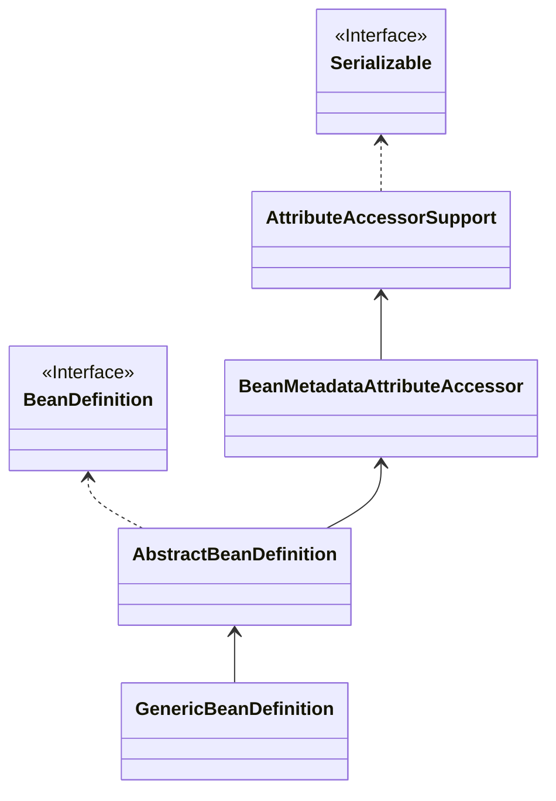
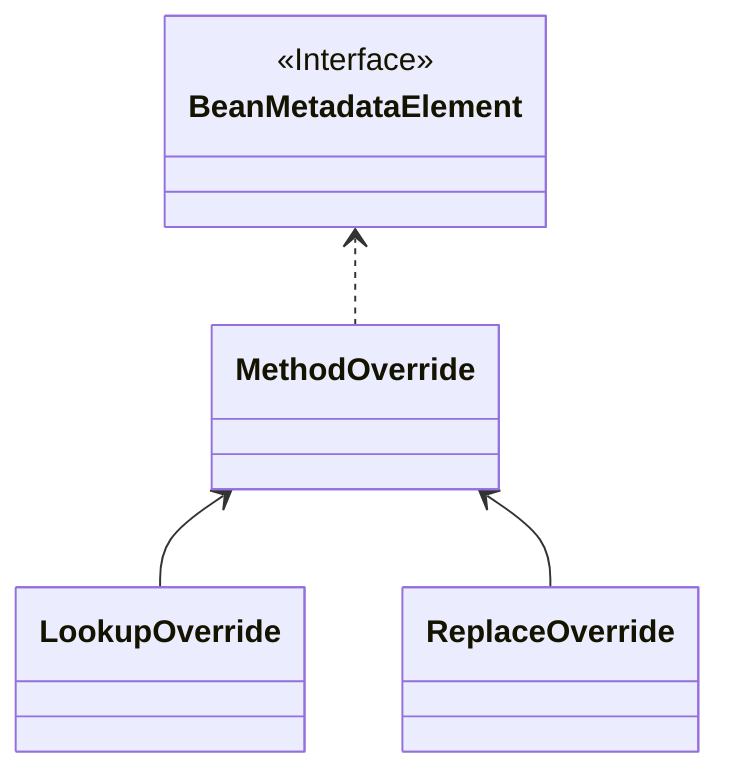

在上一讲中，已经知道了如何加载资源文件，但是事实上加载资源的时候更多的只是拿到资源文件的引用，并没做进一步的内容解析，所以还需要对资源文件进行解析。

以 ClassPathXmlApplicationContext 为例，从名称上就能知道，它加载的资源文件其实是 xml 配置文件。

那么具体是如何解析？解析完成之后得到的又是什么呢？

这就是本文的主题：BeanDefinition。

总体来讲，其实就是这样一个过程：


其中 ResourceLoader 将 xml 文件加载成为 xml resource 这一步，我们已经讲过。本章将关注 DocumentLoader 将 xml resource 转换为 xml document，以及 BeanDefinitionReader 再将 xml document 转换为 BeanDefinition。

BeanDefinition 包含了创建一个 bean 所需要的数据，它不是 bean，而是定义一个 bean 所需的数据就在其中。

## loadBeanDefinitions()

在 AbstractXmlApplicationContext 中，有 loadBeanDefinitions(XmlBeanDefinitionReader reader) 方法，接收一个 XmlBeanDefinitionReader 参数，用来获取 BeanDefinition。

> 需要知道的是，AbstractXmlApplicationContext 是持有一个 BeanFactory 对象的，初始化时，需要先初始化一个 BeanFactory 的对象，然后才开始解析 BeanDefinition。

```java
	protected void loadBeanDefinitions(XmlBeanDefinitionReader reader) throws BeansException, IOException {
		// 这里其实是最开始穿配置文件的资源对象
		// 这里会判断当前是否拿到了配置资源对象，
		Resource[] configResources = getConfigResources();
		if (configResources != null) {
			// 如果有，就直接通过资源对象解析 BeanDefinition
			reader.loadBeanDefinitions(configResources); // 1
		}
		// 判断是否有配置文件的路径信息
		String[] configLocations = getConfigLocations();
		if (configLocations != null) {
			// 如果有，解析 Xml 为 BeanDefinition，这里最终依然会拿到配置文件的配置资源对象，
			// 然后调用上面的 loadBeanDefinitions
			// 注意这里有两个 loadBeanDefinitions() 方法，但是入参一个是 Resource 对象，
			// 一个是配置文件的路径，后者最终依然会调到入参是 Resource 对象的 loadBeanDefinitions()
			reader.loadBeanDefinitions(configLocations); // 2
		}
	}
```

这里会发现有两个地方调用了 reader.loadBeanDefinitions() 方法，只不过入参类型不一样：

1. XmlBeanDefinitionReader#loadBeanDefinitions(Resource... resources)

   直接传入 Resource 对象进行解析。

2. XmlBeanDefinitionReader#loadBeanDefinitions(String... locations)

   传入的是资源的地址，深入查看会发现其实还是会加载成 Resource 对象后调用第一个方法。

> 当拿到 Resource 对象后，并不是直接就开始解析，而是还使用 EncodedResource 做了一层封装，看名称就知道是为了指定资源的字符编码的。

```java
	public int loadBeanDefinitions(EncodedResource encodedResource) throws BeanDefinitionStoreException {
		Assert.notNull(encodedResource, "EncodedResource must not be null");
		if (logger.isTraceEnabled()) {
			logger.trace("Loading XML bean definitions from " + encodedResource);
		}
		// 从线程上下文中获取已经开始加载的 EncodingResource 对象
		Set<EncodedResource> currentResources = this.resourcesCurrentlyBeingLoaded.get();

		// 尝试将 encodingResource 添加进线程上下文持有的 HashSet 中，如果添加失败，说明存在循环加载，就会直接报错。
		if (!currentResources.add(encodedResource)) {
			throw new BeanDefinitionStoreException(
					"Detected cyclic loading of " + encodedResource + " - check your import definitions!");
		}
		// 获取 Resource 对象的 InputStream 输入流，这里需要注意，Resource 接口是继承了 InputStream 接口
		try (InputStream inputStream = encodedResource.getResource().getInputStream()) {
			// 转换为 InputSource
			InputSource inputSource = new InputSource(inputStream);
			// 设置编码集
			if (encodedResource.getEncoding() != null) {
				inputSource.setEncoding(encodedResource.getEncoding());
			}
			// 真的加载 BeanDefinition
			return doLoadBeanDefinitions(inputSource, encodedResource.getResource());
		}
		catch (IOException ex) {
			throw new BeanDefinitionStoreException(
					"IOException parsing XML document from " + encodedResource.getResource(), ex);
		}
		finally {
			// 从线程上下文中的 encodingResources 的 HashSet 中移除 
			currentResources.remove(encodedResource);
			if (currentResources.isEmpty()) {
				this.resourcesCurrentlyBeingLoaded.remove();
			}
		}
	}
```

1. 首先会从线程上下文中获取一个用于记录已经开始加载的 EncodedResouce 对象的 HashSet，用于判断是否有循环加载。
2. 然后获取资源的 InputStream，Resource 接口是继承了 InputStream 接口的，所以这里能直接调用 getInputStream() 方法获取 InputStream。
3. 然后就是为 xml 的解析做准备，这里采用的是 sax 解析，所以首先将 InputStream 对象转换成了 sax 库的 InputSource 对象，并设置了字符编码集。
4. 执行 doLoadBeanDefinition() 方法，做进一步处理。这里就是要开始解析 xml 文件，并将得到的 BeanDefnition 进行注册了。

```java
	protected int doLoadBeanDefinitions(InputSource inputSource, Resource resource)
			throws BeanDefinitionStoreException {
		try {
			// 解析 xml 为 Document 对象
			Document doc = doLoadDocument(inputSource, resource);
			// 注册 BeanDefinition
			int count = registerBeanDefinitions(doc, resource);
			if (logger.isDebugEnabled()) {
				logger.debug("Loaded " + count + " bean definitions from " + resource);
			}
			return count;
		}
		// catch...异常处理
	}
```

在 doLoadBeanDefinition() 方法中会先解析 InputSource，得到一个 Document 文档对象，再通过文档对象进行 BeanDefinition 的注册。

```java
	public int registerBeanDefinitions(Document doc, Resource resource) throws BeanDefinitionStoreException {
		// 创建 BeanDefinitionDocumentReader
		BeanDefinitionDocumentReader documentReader = createBeanDefinitionDocumentReader();
		// 获取当前已注册的 BeanDefinition 数量
		int countBefore = getRegistry().getBeanDefinitionCount();
		// 解析并注册 BeanDefinition
		documentReader.registerBeanDefinitions(doc, createReaderContext(resource));
		return getRegistry().getBeanDefinitionCount() - countBefore;
	}
```

这里创建了一个 BeanDefinitionDocumentReader，用于从 Document 对象中读取 BeanDefinition。

最终会执行到 `DefaultBeanDefinitionDocumentReader#doRegisterBeanDefinitions(Element root)` 方法中：

```java
	protected void doRegisterBeanDefinitions(Element root) {
		// 创建解析器的委托类，具体的解析操作由 BeanDefinitionParserDelegate 完成
		BeanDefinitionParserDelegate parent = this.delegate;
		this.delegate = createDelegate(getReaderContext(), root, parent);
		// 命名空间是否是默认命名空间：空或者 http://www.springframework.org/schema/beans
		if (this.delegate.isDefaultNamespace(root)) {
			// 获取配置的 profile 属性
			String profileSpec = root.getAttribute(PROFILE_ATTRIBUTE);
			if (StringUtils.hasText(profileSpec)) {
				// 如果有指定 profile, 对 profile 的字符串进行拆解，多个 profile 以英文逗号或分号分隔
				String[] specifiedProfiles = StringUtils.tokenizeToStringArray(
						profileSpec, BeanDefinitionParserDelegate.MULTI_VALUE_ATTRIBUTE_DELIMITERS);
				// 检查是否有指定的 profile 被激活
				if (!getReaderContext().getEnvironment().acceptsProfiles(specifiedProfiles)) {
					if (logger.isDebugEnabled()) {
						logger.debug("Skipped XML bean definition file due to specified profiles [" + profileSpec +
								"] not matching: " + getReaderContext().getResource());
					}
					return;
				}
			}
		}
		// 预留的 xml 处理前置逻辑，默认是不做任何操作
		preProcessXml(root);
		// 解析 BeanDefinition
		parseBeanDefinitions(root, this.delegate);
		// 预留的 xml 处理后置逻辑，默认不做任何操作
		postProcessXml(root);
		this.delegate = parent;
	}
```

这里将解析 xml 的逻辑又委托到了 BeanDefinitionParserDelegate 类中，并且考虑到 `<beans>` 嵌套的情况，所以初始化 BeanDefinitionParserDelegate 时，还传入了父 BeanDefinitionParserDelegate。

对于多 profile 的支持，也是在上面获取 beans 标签的 profile 属性部分的逻辑进行支持的。

然后，再进一步看看 parseBeanDefinitions() 方法的逻辑。

## parseBeanDefinitions()

```java
	protected void parseBeanDefinitions(Element root, BeanDefinitionParserDelegate delegate) {
		// 是否是 spring 默认的命名空间
		if (delegate.isDefaultNamespace(root)) {
			// 获取子节点列表
			NodeList nl = root.getChildNodes();
			for (int i = 0; i < nl.getLength(); i++) {
				Node node = nl.item(i);
				if (node instanceof Element) {
					Element ele = (Element) node;
					// 子节点是否是默认命名空间中的标签
					if (delegate.isDefaultNamespace(ele)) {
						// 解析默认标签节点
						parseDefaultElement(ele, delegate);
					}
					else {
						// 自定义标签解析
						delegate.parseCustomElement(ele);
					}
				}
			}
		}
		else {
			// 解析自定义标签
			delegate.parseCustomElement(root);
		}
	}
```

首先判断是否是默认的命名空间，如果是，就调用 spring 的解析逻辑，如果不是，那就证明是第三方集成的组件，需要走到 else 的逻辑，调用第三方自定义的标签解析逻辑。

而如果是 spring 的默认命名空间，但是子节点的所属命名空间又不在 spring 的命名空间中，依然会走自定义的解析逻辑。

这里我们首先就需要举个例子了解一下 xml 这个命名空间里命名空间。

```xml
<?xml version="1.0" encoding="UTF-8"?>
<beans xmlns="http://www.springframework.org/schema/beans"
		xmlns:xsi="http://www.w3.org/2001/XMLSchema-instance"
		xmlns:aop="http://www.springframework.org/schema/aop"
		xmlns:context="http://www.springframework.org/schema/context"
		xsi:schemaLocation="http://www.springframework.org/schema/beans https://www.springframework.org/schema/beans/spring-beans-2.0.xsd
				http://www.springframework.org/schema/aop https://www.springframework.org/schema/aop/spring-aop-2.0.xsd
				http://www.springframework.org/schema/context https://www.springframework.org/schema/context/spring-context-2.5.xsd">

	<context:annotation-config/>

	<aop:aspectj-autoproxy/>

	<bean class="org.springframework.scheduling.annotation.AsyncAnnotationAdvisor"></bean>
</beans>
```

上面的 xml 中， 引入的命名空间都在 beans 标签的 xmlns 系列的属性中，除了第一个是默认的，其余的比如 aop、context 命名空间，在使用时，一般都会在标签名前加上所属的命名空间。

> 这里会发现 spring 有单独的 aop、context 命名空间，也体现了 spring 设计上的解耦。

这样，就能理解前面的关于命名空间的判断逻辑了。

那么，我们接下来需要看看以下两个方法：

* 默认命名空间的标签解析：`DefaultBeanDefinitionDocumentReader#parseDefaultElement(Element ele, BeanDefinitionParserDelegate delegate)`
* 自定义命名空间的标签解析：`BeanDefinitionParserDelegate#parseCustomElement(Element ele)`

这里暂时只看默认命名空间的标签解析，自定义标签的解析将在下一篇文章中讲解。

```java
	private void parseDefaultElement(Element ele, BeanDefinitionParserDelegate delegate) {
		// 解析<import>标签
		if (delegate.nodeNameEquals(ele, IMPORT_ELEMENT)) {
			importBeanDefinitionResource(ele);
		}
		else if (delegate.nodeNameEquals(ele, ALIAS_ELEMENT)) {
			// 解析<alias>标签
			processAliasRegistration(ele);
		}
		else if (delegate.nodeNameEquals(ele, BEAN_ELEMENT)) {
			// 解析<bean>标签
			processBeanDefinition(ele, delegate);
		}
		else if (delegate.nodeNameEquals(ele, NESTED_BEANS_ELEMENT)) {
			// beans 中嵌套了 beans 标签，这里需要递归调用 doRegisterBeanDefinitions 方法
			doRegisterBeanDefinitions(ele);
		}
	}
```

这里引入了 4 种标签的解析：

* import

  导入其他的资源文件。

* alias

  别名。

* bean

  bean 标签，可解析成一个 BeanDefinition 对象。

* beans

  相当于在 beans 标签中嵌套了 beans 标签。

### import 标签

Import 标签使用的形式一般如下：

```xml
<import resource="beanConfigurerTests-beans.xml"/>
```

resource 属性用来指定要导入的资源的位置。

```java
	protected void importBeanDefinitionResource(Element ele) {
		// 获取  resource 属性
		String location = ele.getAttribute(RESOURCE_ATTRIBUTE);
		if (!StringUtils.hasText(location)) {
			// resource 属性为空，记录错误，返回
			getReaderContext().error("Resource location must not be empty", ele);
			return;
		}
		// 处理 resource 属性值中类似 ${user.dir} 这样的变量占位
		location = getReaderContext().getEnvironment().resolveRequiredPlaceholders(location);

		Set<Resource> actualResources = new LinkedHashSet<>(4);

		// Discover whether the location is an absolute or relative URI
		boolean absoluteLocation = false;
		try {
			// 判断 resource 配置的是绝对位置还是相对位置
			absoluteLocation = ResourcePatternUtils.isUrl(location) || ResourceUtils.toURI(location).isAbsolute();
		}
		catch (URISyntaxException ex) {
			// cannot convert to an URI, considering the location relative
			// unless it is the well-known Spring prefix "classpath*:"
		}

		// Absolute or relative?
		if (absoluteLocation) {
			try {
				// 如果是绝对位置，又回到最初的入参为资源的 location 的 loadBeanDefinitions 方法进行 BeanDefinition 的加载注册
				int importCount = getReaderContext().getReader().loadBeanDefinitions(location, actualResources);
				if (logger.isTraceEnabled()) {
					logger.trace("Imported " + importCount + " bean definitions from URL location [" + location + "]");
				}
			}
			catch (BeanDefinitionStoreException ex) {
				getReaderContext().error(
						"Failed to import bean definitions from URL location [" + location + "]", ele, ex);
			}
		}
		else {
			// No URL -> considering resource location as relative to the current file.
			try {
				// 尝试当成相对位置处理
				int importCount;
				// 通过相对位置加载 Resource，这是 Resource 接口提供的能力，用于创建当前 Resource 相对路径下某资源的 Resource 对象
				Resource relativeResource = getReaderContext().getResource().createRelative(location);
				if (relativeResource.exists()) {
					// 如果资源对应文件是存在的，就开始加载资源中的 BeanDefinition
					importCount = getReaderContext().getReader().loadBeanDefinitions(relativeResource);
					actualResources.add(relativeResource);
				}
				else {
					// 如果不存在，则直接将资源的绝对路径传到 loadBeanDefinition 方法中，由其内部逻辑进行加载。
					String baseLocation = getReaderContext().getResource().getURL().toString();
					importCount = getReaderContext().getReader().loadBeanDefinitions(
							StringUtils.applyRelativePath(baseLocation, location), actualResources);
				}
				if (logger.isTraceEnabled()) {
					logger.trace("Imported " + importCount + " bean definitions from relative location [" + location + "]");
				}
			}
			catch (IOException ex) {
				getReaderContext().error("Failed to resolve current resource location", ele, ex);
			}
			catch (BeanDefinitionStoreException ex) {
				getReaderContext().error(
						"Failed to import bean definitions from relative location [" + location + "]", ele, ex);
			}
		}
		Resource[] actResArray = actualResources.toArray(new Resource[0]);
		// 发布触发导入处理事件
		getReaderContext().fireImportProcessed(location, actResArray, extractSource(ele));
	}
```

1. 对 import 标签的解析首先判断了标签的 resource 属性是否有值，如果没有值，会记录错误并解析结束。
2. 对于 resource 属性的值存在 `${user.dir}` 这种情况，需要提前进行处理。
3. 定义了一个叫做 actualResources 的 Set，用于记录当前这个 import 标签导入的 Resource 对象。
4. 需要判断 resource 的地址是相对路径还是绝对路径。
5. 如果是绝对路径，直接调用参数为资源路径字符串的 loadBeanDefinitions 方法进行加载，其实就回到了最开始通过一个资源文件位置来加载 BeanDefinition 的时候了。
6. 如果不是绝对路径，就当成是相对路径处理，先根据相对路径创建一个 Resource 对象，然后使用 Resource 接口提供的 exists() 方法判断资源文件是否存在，如果存在，则调用 loadBeanDefinitions() 方法，通过 Resource 对象加载 BeanDefinition，如果资源文件不存在，那就是可能是 Resource 类型不对，那就拼接处完整的绝对路径，调用 loadBeanDefinitions() 方法，通过资源文件路径加载 BeanDefinition。

综上所述，其实最终都还是加载了 resource 对应的 Resource 对象，然后再解析出 BeanDefinition。

### alias 标签

Alias 标签使用一般如下：

```xml
<alias name="testBean" alias="testBeanAlias1"/>
```

name 属性为要起别名的 bean 的名字，alias 为别名。

```java
	protected void processAliasRegistration(Element ele) {
		// 获取 name 属性
		String name = ele.getAttribute(NAME_ATTRIBUTE);
		// 获取 alias 属性
		String alias = ele.getAttribute(ALIAS_ATTRIBUTE);
		boolean valid = true;
		// 检查 name 是否有效
		if (!StringUtils.hasText(name)) {
			getReaderContext().error("Name must not be empty", ele);
			valid = false;
		}
		// 检查 alias 是否有效
		if (!StringUtils.hasText(alias)) {
			getReaderContext().error("Alias must not be empty", ele);
			valid = false;
		}
		if (valid) {
			// name、alias 都有效
			try {
				// 注册别名到 BeanFactory 中
				getReaderContext().getRegistry().registerAlias(name, alias);
			}
			catch (Exception ex) {
				getReaderContext().error("Failed to register alias '" + alias +
						"' for bean with name '" + name + "'", ele, ex);
			}
			// 发布 alias 标签处理事件
			getReaderContext().fireAliasRegistered(name, alias, extractSource(ele));
		}
	}
```

1. 首先获取 `<alias>` 标签的 name、alias 属性，然后检查是否为空，只要其中有一个为空，解析就结束了。
2. name、alias 属性都不为空，则将别名注册到 BeanFactory 中，这里只需要知道在 BeanFactory 中哟一个 Map 专门用来记录每个 bean 的别名，其 key 为别名，value 为真正 bean 的名称。
3. 发布 alias 标签处理事件。

### beans 标签解析

其实就是递归调用了 doRegisterBeanDefinitions() 方法而已。

### bean 标签解析

bean 标签是相当常用的标签了，一般用法示例：

```xml
	<bean id="orderedBeforeTransaction" class="org.springframework.aop.framework.autoproxy.OrderedTxCheckAdvisor">
		<property name="order"><value>9</value></property>
		<property name="requireTransactionContext"><value>false</value></property>
	</bean>
```

解析 bean 标签的逻辑位于 `DefaultBeanDefinitionDocumentReader#processBeanDefinition(...) `方法中

```java
	protected void processBeanDefinition(Element ele, BeanDefinitionParserDelegate delegate) {
		// BeanDefinitionHolder 中保存了 BeanDefinition 和 bean 名称以及别名
		BeanDefinitionHolder bdHolder = delegate.parseBeanDefinitionElement(ele);
		if (bdHolder != null) {
			// 解析 xml 中的自定义命名空间（如果有的话）
			bdHolder = delegate.decorateBeanDefinitionIfRequired(ele, bdHolder);
			try {
				// Register the final decorated instance.
				// 将 BeanDefinition 注册到 BeanFactory 的 beanDefinitionMap
				BeanDefinitionReaderUtils.registerBeanDefinition(bdHolder, getReaderContext().getRegistry());
			}
			catch (BeanDefinitionStoreException ex) {
				getReaderContext().error("Failed to register bean definition with name '" +
						bdHolder.getBeanName() + "'", ele, ex);
			}
			// Send registration event. 发送 BeanDefinition 注册完成事件
			getReaderContext().fireComponentRegistered(new BeanComponentDefinition(bdHolder));
		}
	}
```

1. 使用 BeanDefinitionParserDelegate#parseBeandDefinition(Element ele) 方法解析标签，得到 BeanDefinitionHolder。
2. 自定义标签装饰逻辑。
3. 调用 BeanDefinitionReaderUtils 注册 BeanDefinition，总体来讲就是建立 beanName 和 BeanDefinition 的映射关系，以及 alias 和 beanName 的映射关系。

会发现这里将解析 BeandDefinition 的逻辑又放到了 `BeanDefinitionParserDelegate#parseBeandDefinition(Element ele)` 方法中，而且返回的也不是 BeanDefinition，而是 BeanDefinitionHolder 对象，BeanDefinitionHoldern 对象持有一个 BeanDefinition 对象，bean 名称，以及 bean 的别名。

```java
public class BeanDefinitionHolder implements BeanMetadataElement {

	private final BeanDefinition beanDefinition;

	private final String beanName;

	@Nullable
	private final String[] aliases;

}
```

然后就是针对标签属性的命名空间的自定义解析逻辑，这部分对于自定义命名空间的使用，后文单独讲解。

这里我们先深入看看 `BeanDefinitionParserDelegate#parseBeandDefinition(Element ele)` 是如何拿到 BeanDefinitionHolder 的。

```java
	public BeanDefinitionHolder parseBeanDefinitionElement(Element ele, @Nullable BeanDefinition containingBean) {
		/**
		 * containingBean 其实是父 bean 的 BeanDefinition
		 */

		// 获取 id 属性值
		String id = ele.getAttribute(ID_ATTRIBUTE);

		// 获取 name 属性值，解析成 bean 的别名，多个别名用英文逗号分割
		String nameAttr = ele.getAttribute(NAME_ATTRIBUTE);
		List<String> aliases = new ArrayList<>();
		if (StringUtils.hasLength(nameAttr)) {
			// 将多个别名按英文逗号或分号分割
			String[] nameArr = StringUtils.tokenizeToStringArray(nameAttr, MULTI_VALUE_ATTRIBUTE_DELIMITERS);
			aliases.addAll(Arrays.asList(nameArr));
		}

		// 如果 id 为空，则取 name 属性中的第一个别名作为默认的 beanName
		String beanName = id;
		if (!StringUtils.hasText(beanName) && !aliases.isEmpty()) {
			beanName = aliases.remove(0);
			if (logger.isTraceEnabled()) {
				logger.trace("No XML 'id' specified - using '" + beanName +
						"' as bean name and " + aliases + " as aliases");
			}
		}

		if (containingBean == null) {
			checkNameUniqueness(beanName, aliases, ele);
		}

		// 解析一个 AbstractBeanDefinition 对象，其实是一个 GenericBeanDefinition 对象
		AbstractBeanDefinition beanDefinition = parseBeanDefinitionElement(ele, beanName, containingBean);
		// 生成默认的 beanName
		if (beanDefinition != null) {
			if (!StringUtils.hasText(beanName)) {
				try {
					if (containingBean != null) {
						beanName = BeanDefinitionReaderUtils.generateBeanName(
								beanDefinition, this.readerContext.getRegistry(), true);
					}
					else {
						beanName = this.readerContext.generateBeanName(beanDefinition);
						// Register an alias for the plain bean class name, if still possible,
						// if the generator returned the class name plus a suffix.
						// This is expected for Spring 1.2/2.0 backwards compatibility.
						String beanClassName = beanDefinition.getBeanClassName();
						if (beanClassName != null &&
								beanName.startsWith(beanClassName) && beanName.length() > beanClassName.length() &&
								!this.readerContext.getRegistry().isBeanNameInUse(beanClassName)) {
							aliases.add(beanClassName);
						}
					}
					if (logger.isTraceEnabled()) {
						logger.trace("Neither XML 'id' nor 'name' specified - " +
								"using generated bean name [" + beanName + "]");
					}
				}
				catch (Exception ex) {
					error(ex.getMessage(), ele);
					return null;
				}
			}
			String[] aliasesArray = StringUtils.toStringArray(aliases);
			return new BeanDefinitionHolder(beanDefinition, beanName, aliasesArray);
		}

		return null;
	}
```

1. 首先获取了 bean 标签的 id、name 属性，对于 name 属性存在多个名字的情况，以英文逗号或者分号进行分割。
2. 默认 beanName 为 id 属性的值，如果 id 属性未配置，则以 name 属性解析出的第一个名称为 beanName，并从 alias 别名列表中移除。
3. 检查别名和 beanName 是否已经被注册过了，如果是，就会抛出 beanName 冲突异常。
4. 调用 `parseBeanDefinitionElement(...)` 方法解析得到 BeanDefinition 对象。
5. 如果 beanName 为空，则由 BeanFactory 生成一个 beanName。
6. 最后生成一个 BeanDefinitionHolder 对象并返回。

然后看看 `parseBeanDefinitionElement(...)` 方法：

```java
	public AbstractBeanDefinition parseBeanDefinitionElement(
			Element ele, String beanName, @Nullable BeanDefinition containingBean) {

		this.parseState.push(new BeanEntry(beanName));

		// 解析 class 属性
		String className = null;
		if (ele.hasAttribute(CLASS_ATTRIBUTE)) {
			className = ele.getAttribute(CLASS_ATTRIBUTE).trim();
		}
		// 解析 parent 属性
		String parent = null;
		if (ele.hasAttribute(PARENT_ATTRIBUTE)) {
			parent = ele.getAttribute(PARENT_ATTRIBUTE);
		}

		try {
			// 创建 AbstractBeanDefinition 的子类 GenericBeanDefinition
			AbstractBeanDefinition bd = createBeanDefinition(className, parent);
			// 解析 bean 标签属性
			parseBeanDefinitionAttributes(ele, beanName, containingBean, bd);
			// 设置 description，通过 <description> 子标签获取
			bd.setDescription(DomUtils.getChildElementValueByTagName(ele, DESCRIPTION_ELEMENT));
			// 解析元数据
			parseMetaElements(ele, bd);
			// 解析 lookup-method 子标签
			parseLookupOverrideSubElements(ele, bd.getMethodOverrides());
			// 解析 replaced-method 子标签
			parseReplacedMethodSubElements(ele, bd.getMethodOverrides());
			// 解析 constructor-arg 子标签
			parseConstructorArgElements(ele, bd);
			// 解析 property 子标签
			parsePropertyElements(ele, bd);
			// 解析 Qualifier 子节点
			parseQualifierElements(ele, bd);

			bd.setResource(this.readerContext.getResource());
			bd.setSource(extractSource(ele));

			return bd;
		}
		catch (ClassNotFoundException ex) {
			error("Bean class [" + className + "] not found", ele, ex);
		}
		catch (NoClassDefFoundError err) {
			error("Class that bean class [" + className + "] depends on not found", ele, err);
		}
		catch (Throwable ex) {
			error("Unexpected failure during bean definition parsing", ele, ex);
		}
		finally {
			this.parseState.pop();
		}

		return null;
	}
```

1. 首先就拿到了 class 属性和 parent 属性的值，然后创建了一个 BeanDefinition。

2. 解析 bean 标签的属性。

3. bean 标签的一系列子标签的解析，包括：

   1. description
   2. meta
   3. lookup-method
   4. replaced-method
   5. constructor-arg
   6. property
   7. qualifier

接下来，会逐步进行分析。

#### 创建 BeanDefinition

对应 createBeanDefinition() 方法：

```java
	protected AbstractBeanDefinition createBeanDefinition(@Nullable String className, @Nullable String parentName)
			throws ClassNotFoundException {

		return BeanDefinitionReaderUtils.createBeanDefinition(
				parentName, className, this.readerContext.getBeanClassLoader());
	}
```

委托给了 BeanDefinitionReaderUtils 进行创建。

```java
	public static AbstractBeanDefinition createBeanDefinition(
			@Nullable String parentName, @Nullable String className, @Nullable ClassLoader classLoader) throws ClassNotFoundException {

		GenericBeanDefinition bd = new GenericBeanDefinition();
		bd.setParentName(parentName);
		if (className != null) {
			if (classLoader != null) {
				bd.setBeanClass(ClassUtils.forName(className, classLoader));
			}
			else {
				bd.setBeanClassName(className);
			}
		}
		return bd;
	}
```

此时可以得到结论，那就是一开始创建的 BeanDefinition 都是 GenericBeanDefinition。

这里将 bean 对应的 Class 或者 ClassName 设置了进去。

#### 解析 bean 标签属性

```java
	public AbstractBeanDefinition parseBeanDefinitionAttributes(Element ele, String beanName,
			@Nullable BeanDefinition containingBean, AbstractBeanDefinition bd) {
		// singleton 属性已经过时，需要使用 scope 属性
		if (ele.hasAttribute(SINGLETON_ATTRIBUTE)) {
			error("Old 1.x 'singleton' attribute in use - upgrade to 'scope' declaration", ele);
		}
		else if (ele.hasAttribute(SCOPE_ATTRIBUTE)) {
			// 如果有 scope 属性，就设置 scope
			bd.setScope(ele.getAttribute(SCOPE_ATTRIBUTE));
		}
		else if (containingBean != null) {
			// 如果没有 scope 属性，但是有父 bean，则使用父 bean 的 scope 值。
			// Take default from containing bean in case of an inner bean definition.
			bd.setScope(containingBean.getScope());
		}

		if (ele.hasAttribute(ABSTRACT_ATTRIBUTE)) {
			// 设置是否为抽象，即不会实例化，而只是作为其他 bean 的父类，默认为 false
			bd.setAbstract(TRUE_VALUE.equals(ele.getAttribute(ABSTRACT_ATTRIBUTE)));
		}

		String lazyInit = ele.getAttribute(LAZY_INIT_ATTRIBUTE);
		if (isDefaultValue(lazyInit)) {
			// 是否懒加载，如果设置为 true，则 bean 将会在第一次使用到时由工厂初始化，默认为 false
			lazyInit = this.defaults.getLazyInit();
		}
		bd.setLazyInit(TRUE_VALUE.equals(lazyInit));

		String autowire = ele.getAttribute(AUTOWIRE_ATTRIBUTE);
		// 设置自动注入模式
		bd.setAutowireMode(getAutowireMode(autowire));

		// 设置依赖的 bean 名称
		if (ele.hasAttribute(DEPENDS_ON_ATTRIBUTE)) {
			String dependsOn = ele.getAttribute(DEPENDS_ON_ATTRIBUTE);
			bd.setDependsOn(StringUtils.tokenizeToStringArray(dependsOn, MULTI_VALUE_ATTRIBUTE_DELIMITERS));
		}

		String autowireCandidate = ele.getAttribute(AUTOWIRE_CANDIDATE_ATTRIBUTE);
		if (isDefaultValue(autowireCandidate)) {
			String candidatePattern = this.defaults.getAutowireCandidates();
			if (candidatePattern != null) {
				String[] patterns = StringUtils.commaDelimitedListToStringArray(candidatePattern);
				bd.setAutowireCandidate(PatternMatchUtils.simpleMatch(patterns, beanName));
			}
		}
		else {
			bd.setAutowireCandidate(TRUE_VALUE.equals(autowireCandidate));
		}

		// 设置 primary
		if (ele.hasAttribute(PRIMARY_ATTRIBUTE)) {
			bd.setPrimary(TRUE_VALUE.equals(ele.getAttribute(PRIMARY_ATTRIBUTE)));
		}
		// 设置初始化方法名
		if (ele.hasAttribute(INIT_METHOD_ATTRIBUTE)) {
			String initMethodName = ele.getAttribute(INIT_METHOD_ATTRIBUTE);
			bd.setInitMethodName(initMethodName);
		}
		else if (this.defaults.getInitMethod() != null) {
			bd.setInitMethodName(this.defaults.getInitMethod());
			bd.setEnforceInitMethod(false);
		}
		// 设置销毁 bean 的方法名
		if (ele.hasAttribute(DESTROY_METHOD_ATTRIBUTE)) {
			String destroyMethodName = ele.getAttribute(DESTROY_METHOD_ATTRIBUTE);
			bd.setDestroyMethodName(destroyMethodName);
		}
		else if (this.defaults.getDestroyMethod() != null) {
			bd.setDestroyMethodName(this.defaults.getDestroyMethod());
			bd.setEnforceDestroyMethod(false);
		}
		// 设置工厂方法名称
		if (ele.hasAttribute(FACTORY_METHOD_ATTRIBUTE)) {
			bd.setFactoryMethodName(ele.getAttribute(FACTORY_METHOD_ATTRIBUTE));
		}
		// 设置工厂 bean
		if (ele.hasAttribute(FACTORY_BEAN_ATTRIBUTE)) {
			bd.setFactoryBeanName(ele.getAttribute(FACTORY_BEAN_ATTRIBUTE));
		}
		return bd;
	}
```

这一段是对 `<bean>` 的各项属性进行解析，并放进 BeanDefinition 中，比较简单，不细说。

#### 解析 description 标签

```java
	public static String getChildElementValueByTagName(Element ele, String childEleName) {
		Element child = getChildElementByTagName(ele, childEleName);
		return (child != null ? getTextValue(child) : null);
	}

	public static Element getChildElementByTagName(Element ele, String childEleName) {
		Assert.notNull(ele, "Element must not be null");
		Assert.notNull(childEleName, "Element name must not be null");
		NodeList nl = ele.getChildNodes();
		for (int i = 0; i < nl.getLength(); i++) {
			Node node = nl.item(i);
			if (node instanceof Element && nodeNameMatch(node, childEleName)) {
				return (Element) node;
			}
		}
		return null;
	}
```

其实就是找了一个 bean 标签下名为 `description` 的子标签，然后拿了标签中的值设置到了 BeanDefinition 中。

#### 解析 meta 标签

```java
	public void parseMetaElements(Element ele, BeanMetadataAttributeAccessor attributeAccessor) {
    // ele 是 meta 的父标签
		NodeList nl = ele.getChildNodes();
		for (int i = 0; i < nl.getLength(); i++) {
			Node node = nl.item(i);
			// 是 Spring 默认标签体系中的标签，且为 <meta> 标签
			if (isCandidateElement(node) && nodeNameEquals(node, META_ELEMENT)) {
				Element metaElement = (Element) node;
				// 获取 key 属性
				String key = metaElement.getAttribute(KEY_ATTRIBUTE);
				// 获取 value 属性
				String value = metaElement.getAttribute(VALUE_ATTRIBUTE);
				BeanMetadataAttribute attribute = new BeanMetadataAttribute(key, value);
				attribute.setSource(extractSource(metaElement));
				attributeAccessor.addMetadataAttribute(attribute);
			}
		}
	}
```

meta 标签使用一般如下：

```xml
    <bean ...>
        <meta key="priority" value="1"/>
    </bean>
```

然后再对照上面的代码。

1. ele 是 meta 的父标签，首先获取了 ele 的子标签的列表；
2. 然后再进行遍历，遍历时，判断了是否是 meta 标签；
3. 如果是 meta 标签，则获取 meta 标签的 key、value 属性，并构建一个 BeanMetadataAttribute，放到 BeanDefinition 中。

需要注意的是，第 3 步说的是放到 BeanDefinition 中，但实际又是调用的 BeanMetadataAttributeAccessor 实例的方法，其实是因为前面构建的 GenericBeanDefinition 继承自 AbstractBeanDefinition，而 AbstractBeanDefinition 又实现了 BeanMetadataAttributeAccessor 接口。



BeanMetadataAttributeAccessor 提供的是访问 bean 元数据的能力，而最终实现时，其实就是将各种元数据记录了下来，就如同上面讲 meta 标签的 key、value 封装成一个 BeanMetadataAttribute 对象，然后放到了 BeanMetadataAttributeAccessor 中，换言之，对元数据的访问能力不是 BeanDefinition 接口提供的，而是 BeanMetadataAttributeAccessor 提供的。

#### 解析 lookup-method 标签

```java
	public void parseLookupOverrideSubElements(Element beanEle, MethodOverrides overrides) {
		NodeList nl = beanEle.getChildNodes();
		for (int i = 0; i < nl.getLength(); i++) {
			Node node = nl.item(i);
			// lookup-method 标签解析
			if (isCandidateElement(node) && nodeNameEquals(node, LOOKUP_METHOD_ELEMENT)) {
				Element ele = (Element) node;
				// lookup 的方法名
				String methodName = ele.getAttribute(NAME_ATTRIBUTE);
				// lookup 返回的 bean
				String beanRef = ele.getAttribute(BEAN_ELEMENT);
				LookupOverride override = new LookupOverride(methodName, beanRef);
				override.setSource(extractSource(ele));
				overrides.addOverride(override);
			}
		}
	}
```

> lookup-method 平时用的比较少，也是查了资料才知道是干嘛的。

lookup-mthod 一般用法：

```xml
	<bean id="overrideInheritedMethod" class="org.springframework.beans.factory.xml.OverrideOneMethodSubclass">
		<lookup-method name="getPrototypeDependency" bean="jenny"/>
	</bean>
```

上面这样用，其实就是使得 overrideInheritedMethod 这个 bean 的 getPrototypeDependency 方法最终返回 jenny 这个 bean，意思是，哪怕 getPrototypeDependency 方法的实现逻辑上是构建了一个和 jenny 这个 bean 同类型的对象返回，但调用 overrideInheritedMethod 的 getPrototypeDependency 方法最终还是会返回 jenny 这个实例 bean。

> 就有点强行修改 bean 方法的返回对象的意思。

和解析 meta 标签类似，这里也是将 lookup-method 的key、value 封装之后，又放到了一个 BeaDefinition 的对象中，只不过依然不是调用的 BeanDefinition 接口的能力，而是 MethodOverrides 接口的能力，这个接口用来记录 bean 中的方法覆盖。

注意 lookup-method 对应的方法覆盖的记录使用的是 LookupOverride 对象。



然后就会发现它实现的是 MethodOverride 接口，而这个接口只有 LookupOverride、ReplaceOverride 两个实现类，接下里的 replaced-method 标签就和 ReplaceOverride 有关。

#### 解析 replaced-method 标签

replaced-method 标签和 lookup-method 标签类似，不过 replaced-method 标签的切入更加彻底。

一般使用方式如下：

```java
	<bean id="overrideOneMethodByAttribute" class="org.springframework.beans.factory.xml.OverrideOneMethod">
		<replaced-method name="replaceMe" replacer="reverseReplacer"></replaced-method>
	</bean>
	<bean id="overrideOneMethodByElement" class="org.springframework.beans.factory.xml.OverrideOneMethod">
		<replaced-method name="replaceMe" replacer="reverseReplacer">
			<arg-type>String</arg-type>
		</replaced-method>
	</bean>
```

第一个 bean 中的 replaced-method 表示将 overrideOneMethodByAttribute 这个 bean 的 replaceMe 方法的实现直接替换成 reverseReplacer 中的方法，而对于 reverseReplacer 方法的要求是，必须实现 MethodReplacer 接口。

```java
public interface MethodReplacer {
	Object reimplement(Object obj, Method method, Object[] args) throws Throwable;
}
```

#### 解析 constructor-arg 标签

constructor-arg 见名知意，这个标签是用来配置 bean 初始化时的构造函数参数的。

需要知道 constructor-arg 标签的用法。

```xml
	<bean id="parentWithMapInConstructor" class="org.springframework.beans.testfixture.beans.TestBean">
		<constructor-arg index="0">
      <description .../>
			<map>
				<entry key="Rob" value="Sall"/>
				<entry key="Juergen" value="Eva"/>
			</map>
		</constructor-arg>
	</bean>
	<bean id="c" class="java.lang.String">
		<constructor-arg ref="b" />
	</bean>
```

主要分两种方式，一种是直接指定 index 属性，以表明是配置的构造函数的第几个参数，另一种则是不指定 index，而制定参数名称、值等。

Spring 在解析时，也是分成了这两种情况进行解析。

```java
	public void parseConstructorArgElement(Element ele, BeanDefinition bd) {
		// 参数索引下标
		String indexAttr = ele.getAttribute(INDEX_ATTRIBUTE);
		// 参数类型
		String typeAttr = ele.getAttribute(TYPE_ATTRIBUTE);
		// 参数名
		String nameAttr = ele.getAttribute(NAME_ATTRIBUTE);
		// 如果指定了 index
		if (StringUtils.hasLength(indexAttr)) {
			try {
				int index = Integer.parseInt(indexAttr);
				if (index < 0) {
					error("'index' cannot be lower than 0", ele);
				}
				else {
					try {
						this.parseState.push(new ConstructorArgumentEntry(index));
						// 解析属性值对象
						Object value = parsePropertyValue(ele, bd, null);
						ConstructorArgumentValues.ValueHolder valueHolder = new ConstructorArgumentValues.ValueHolder(value);
						if (StringUtils.hasLength(typeAttr)) {
							valueHolder.setType(typeAttr);
						}
						if (StringUtils.hasLength(nameAttr)) {
							valueHolder.setName(nameAttr);
						}
						valueHolder.setSource(extractSource(ele));
						if (bd.getConstructorArgumentValues().hasIndexedArgumentValue(index)) {
							error("Ambiguous constructor-arg entries for index " + index, ele);
						}
						else {
							// 将值记录到 BeanDefinition 的构造函数参数列表中
							bd.getConstructorArgumentValues().addIndexedArgumentValue(index, valueHolder);
						}
					}
					finally {
						this.parseState.pop();
					}
				}
			}
			catch (NumberFormatException ex) {
				error("Attribute 'index' of tag 'constructor-arg' must be an integer", ele);
			}
		}
		else {
			// 对于标签没有指定 index 的情况
			try {
				this.parseState.push(new ConstructorArgumentEntry());
				// 解析标签中的值
				Object value = parsePropertyValue(ele, bd, null);
				ConstructorArgumentValues.ValueHolder valueHolder = new ConstructorArgumentValues.ValueHolder(value);
				if (StringUtils.hasLength(typeAttr)) {
					valueHolder.setType(typeAttr);
				}
				if (StringUtils.hasLength(nameAttr)) {
					valueHolder.setName(nameAttr);
				}
				valueHolder.setSource(extractSource(ele));
				bd.getConstructorArgumentValues().addGenericArgumentValue(valueHolder);
			}
			finally {
				this.parseState.pop();
			}
		}
	}
```

首先获取了标签的 index、type、name 三个属性，对于有 index 和没有 index 属性两种情况分开处理，可以看见有没有 index 属性，其实解析逻辑差别不大，只不过有 index 时，记录了 index 和参数值的对应关系。

不管有没有 index，都会调用 parsePropertyValue 方法解析出值，然后使用 ConstructorArgumentValues.ValueHolder 进行封装。

然后看看具体的参数值的解析。

```java
	public Object parsePropertyValue(Element ele, BeanDefinition bd, @Nullable String propertyName) {
		// 如果是解析 constructor-arg 标签，则不会传入 propertyName 参数，如果传了表示是解析的 property 标签
		String elementName = (propertyName != null ?
				"<property> element for property '" + propertyName + "'" :
				"<constructor-arg> element");
		// 获取子标签
		NodeList nl = ele.getChildNodes();
		Element subElement = null;
		for (int i = 0; i < nl.getLength(); i++) {
			Node node = nl.item(i);
			// 除了 description、meta 子标签，其他子标签总数不能超过一个
			if (node instanceof Element && !nodeNameEquals(node, DESCRIPTION_ELEMENT) &&
					!nodeNameEquals(node, META_ELEMENT)) {
				// Child element is what we're looking for.
				if (subElement != null) {
					error(elementName + " must not contain more than one sub-element", ele);
				}
				else {
					subElement = (Element) node;
				}
			}
		}
		// 是否有 ref 属性
		boolean hasRefAttribute = ele.hasAttribute(REF_ATTRIBUTE);
		// 是否有 value 属性
		boolean hasValueAttribute = ele.hasAttribute(VALUE_ATTRIBUTE);
		// 不能同时有 ref 和 value 两个属性，这两个属性只有其中一个时不能有子节点
		if ((hasRefAttribute && hasValueAttribute) ||
				((hasRefAttribute || hasValueAttribute) && subElement != null)) {
			error(elementName +
					" is only allowed to contain either 'ref' attribute OR 'value' attribute OR sub-element", ele);
		}
		if (hasRefAttribute) {
			// 获取 ref 属性值。有 ref 属性，一般是指向其他的 bean
			String refName = ele.getAttribute(REF_ATTRIBUTE);
			if (!StringUtils.hasText(refName)) {
				error(elementName + " contains empty 'ref' attribute", ele);
			}
			// 先将这个 bean 的引用记录起来
			RuntimeBeanReference ref = new RuntimeBeanReference(refName);
			ref.setSource(extractSource(ele));
			return ref;
		}
		else if (hasValueAttribute) {
			// 创建一个 String 值
			TypedStringValue valueHolder = new TypedStringValue(ele.getAttribute(VALUE_ATTRIBUTE));
			valueHolder.setSource(extractSource(ele));
			return valueHolder;
		}
		else if (subElement != null) {
			// 当 constructor-arg 标签没有 value、ref 属性时，又会有子标签
			// 开始解析子标签
			return parsePropertySubElement(subElement, bd);
		}
		else {
			// Neither child element nor "ref" or "value" attribute found.
			error(elementName + " must specify a ref or value", ele);
			return null;
		}
	}
```

1. 首先判断了 peopertyName 参数是否是 null，如果是 null 说明是解析的 constructor-arg 参数，不然就是 property 参数。

> 这里是框架的代码，到时情有可原，毕竟每个方法调用都是一次进出栈操作。如果是业务代码的话，个人不是很赞同这种实现方式，直接将 constructor-arg 和 property 标签的解析逻辑分开，公共部分抽一个方法就好了啊。

2. 遍历了所有子标签，需要保证 constructor-arg 标签的子标签除了 description 和 meta 标签之外，其他子标签最多只有一个。

3. 解析标签。

   如果 constructor-arg 标签有 ref 属性或 value 属性，则进行对应的封装，且 ref、value 属性只能有其中一个。

   如果配置了 ref 属性，则封装成 RuntimeBeanReference，如果配置的是 value 属性，则封装成 TypedStringValue。

   对于 ref、value 都未配置的情况，需要检查是否有既不是 description，又不是 meta 标签的子标签，如果没有，则报错，如果有，则解析子标签。

解析子标签，和对 ref、value 两个属性的解析目的一致，都是为了得到构造函数的属性值。

```java
	public Object parsePropertySubElement(Element ele, @Nullable BeanDefinition bd, @Nullable String defaultValueType) {
		// 如果不是默认的命名空间的标签，则进行自定义标签解析
		if (!isDefaultNamespace(ele)) {
			return parseNestedCustomElement(ele, bd);
		}
		else if (nodeNameEquals(ele, BEAN_ELEMENT)) {
			// 如果是 bean 标签，则递归调用解析 BeanDefinition
			BeanDefinitionHolder nestedBd = parseBeanDefinitionElement(ele, bd);
			if (nestedBd != null) {
				// 修饰 BeanDefinition
				nestedBd = decorateBeanDefinitionIfRequired(ele, nestedBd, bd);
			}
			return nestedBd;
		}
		else if (nodeNameEquals(ele, REF_ELEMENT)) {
			// 解析 ref 标签
			// 获取 ref 标签的 bean 属性
			String refName = ele.getAttribute(BEAN_REF_ATTRIBUTE);
			boolean toParent = false;
			if (!StringUtils.hasLength(refName)) {
				// A reference to the id of another bean in a parent context.
				// 如果没配置 bean 属性，则尝试从读取 parent 属性，然后从父 context 中获取 bean
				refName = ele.getAttribute(PARENT_REF_ATTRIBUTE);
				toParent = true;
				if (!StringUtils.hasLength(refName)) {
					// 如果 bean、parent 两个属性都没配置，报错
					error("'bean' or 'parent' is required for <ref> element", ele);
					return null;
				}
			}
			// 这里我理解是为了检查 bean 或者 parent 的值是空格的情况
			if (!StringUtils.hasText(refName)) {
				error("<ref> element contains empty target attribute", ele);
				return null;
			}
			RuntimeBeanReference ref = new RuntimeBeanReference(refName, toParent);
			ref.setSource(extractSource(ele));
			return ref;
		}
		else if (nodeNameEquals(ele, IDREF_ELEMENT)) {
			// 解析 <idref> 标签
			return parseIdRefElement(ele);
		}
		else if (nodeNameEquals(ele, VALUE_ELEMENT)) {
			// 解析 value 标签
			return parseValueElement(ele, defaultValueType);
		}
		else if (nodeNameEquals(ele, NULL_ELEMENT)) {
			// It's a distinguished null value. Let's wrap it in a TypedStringValue
			// object in order to preserve the source location.
			// 用于占位的 null 值
			TypedStringValue nullHolder = new TypedStringValue(null);
			nullHolder.setSource(extractSource(ele));
			return nullHolder;
		}
		else if (nodeNameEquals(ele, ARRAY_ELEMENT)) {
			// 解析 array 子标签
			return parseArrayElement(ele, bd);
		}
		else if (nodeNameEquals(ele, LIST_ELEMENT)) {
			// 解析 list 标签，和 array 一样
			return parseListElement(ele, bd);
		}
		else if (nodeNameEquals(ele, SET_ELEMENT)) {
			// 解析 set 标签
			return parseSetElement(ele, bd);
		}
		else if (nodeNameEquals(ele, MAP_ELEMENT)) {
			// 解析 map 标签
			return parseMapElement(ele, bd);
		}
		else if (nodeNameEquals(ele, PROPS_ELEMENT)) {
			// 解析 props 标签, 这里是对 property 标签的支持
			return parsePropsElement(ele);
		}
		else {
			error("Unknown property sub-element: [" + ele.getNodeName() + "]", ele);
			return null;
		}
	}
```

从解析子标签的逻辑上看，子标签可以是自定义标签，如果是自定义标签，就会调用自定义标签的解析逻辑。对于 spring 默认支持的标签有：

* ref
* idref
* value
* null
* array
* list
* set
* map
* props

具体每个标签的解析就不展开了，其实也是比较简单的。

#### 解析 property 标签

```java
	public void parsePropertyElements(Element beanEle, BeanDefinition bd) {
		NodeList nl = beanEle.getChildNodes();
		for (int i = 0; i < nl.getLength(); i++) {
			Node node = nl.item(i);
			if (isCandidateElement(node) && nodeNameEquals(node, PROPERTY_ELEMENT)) {
				parsePropertyElement((Element) node, bd);
			}
		}
	}
```

首先遍历了 bean 标签的所有子标签，找到 property 标签，并调用 parsePropertyElement 方法进行解析。

```java
	public void parsePropertyElement(Element ele, BeanDefinition bd) {
		// 获取 property 的 name 属性
		String propertyName = ele.getAttribute(NAME_ATTRIBUTE);
		if (!StringUtils.hasLength(propertyName)) {
			error("Tag 'property' must have a 'name' attribute", ele);
			return;
		}
		this.parseState.push(new PropertyEntry(propertyName));
		try {
			if (bd.getPropertyValues().contains(propertyName)) {
				error("Multiple 'property' definitions for property '" + propertyName + "'", ele);
				return;
			}
			// 解析属性值
			Object val = parsePropertyValue(ele, bd, propertyName);
			PropertyValue pv = new PropertyValue(propertyName, val);
			parseMetaElements(ele, pv);
			pv.setSource(extractSource(ele));
			bd.getPropertyValues().addPropertyValue(pv);
		}
		finally {
			this.parseState.pop();
		}
	}
```

1. 首先获取 property 标签的 name 属性，该属性必须配置且不能为空。
2. 调用 parsePropertyValue 方法解析，这里和解析 constructor-arg 标签时使用的是同一个方法，不同的是这里将 propertyName 传了进去，但也只是用来打了错误日志而已，逻辑上没有区别。
3. 得到 property 的值之后，封装为 PropertyValue 并放到 Beanefinition 中。

#### 解析 qualifier 标签

qualifier 标签和 @Qualifier 注解一样，用于根据 bean 名称指定要注入的 bean。

解析逻辑如下：

```java
	public void parseQualifierElement(Element ele, AbstractBeanDefinition bd) {
		// 获取 qualifier 标签的 type 属性
		String typeName = ele.getAttribute(TYPE_ATTRIBUTE);
		if (!StringUtils.hasLength(typeName)) {
			error("Tag 'qualifier' must have a 'type' attribute", ele);
			return;
		}
		this.parseState.push(new QualifierEntry(typeName));
		try {
			AutowireCandidateQualifier qualifier = new AutowireCandidateQualifier(typeName);
			qualifier.setSource(extractSource(ele));
			// 获取 value
			String value = ele.getAttribute(VALUE_ATTRIBUTE);
			if (StringUtils.hasLength(value)) {
				qualifier.setAttribute(AutowireCandidateQualifier.VALUE_KEY, value);
			}
			NodeList nl = ele.getChildNodes();
			for (int i = 0; i < nl.getLength(); i++) {
				Node node = nl.item(i);
				if (isCandidateElement(node) && nodeNameEquals(node, QUALIFIER_ATTRIBUTE_ELEMENT)) {
					Element attributeEle = (Element) node;
					// 获取 attribute 子标签的 key、value 属性
					String attributeName = attributeEle.getAttribute(KEY_ATTRIBUTE);
					String attributeValue = attributeEle.getAttribute(VALUE_ATTRIBUTE);
					if (StringUtils.hasLength(attributeName) && StringUtils.hasLength(attributeValue)) {
						BeanMetadataAttribute attribute = new BeanMetadataAttribute(attributeName, attributeValue);
						attribute.setSource(extractSource(attributeEle));
						qualifier.addMetadataAttribute(attribute);
					}
					else {
						error("Qualifier 'attribute' tag must have a 'name' and 'value'", attributeEle);
						return;
					}
				}
			}
			bd.addQualifier(qualifier);
		}
		finally {
			this.parseState.pop();
		}
	}

```

Qualifier 标签解析后，得到 AutowiredCandidateQualifier 对象，并通过  AbstractBeanDefinition.addQualifier 方法放到 BeanDefinition 中。

1. 首先检查了 type 属性，该属性必须配置，且不能为空。

2. 获取 value 属性值，如果值不为空，则将 AutowiredCandidateQualifier 的 value 设置为标签的 value 值。

3. 解析 attribute 子标签。

   attribute 子标签有 key、value 属性，两个属性都是必填项，解析后封装成 BeanMetadataAttribute 对象，并通过 AutowiredCandidateQualifier 的 addMetadataAttribute 方法放到 AutowiredCandidateQualifier 中。

到这里，BeanDefinition 的解析基本就结束了，下一篇将讲解自定义标签的解析。
