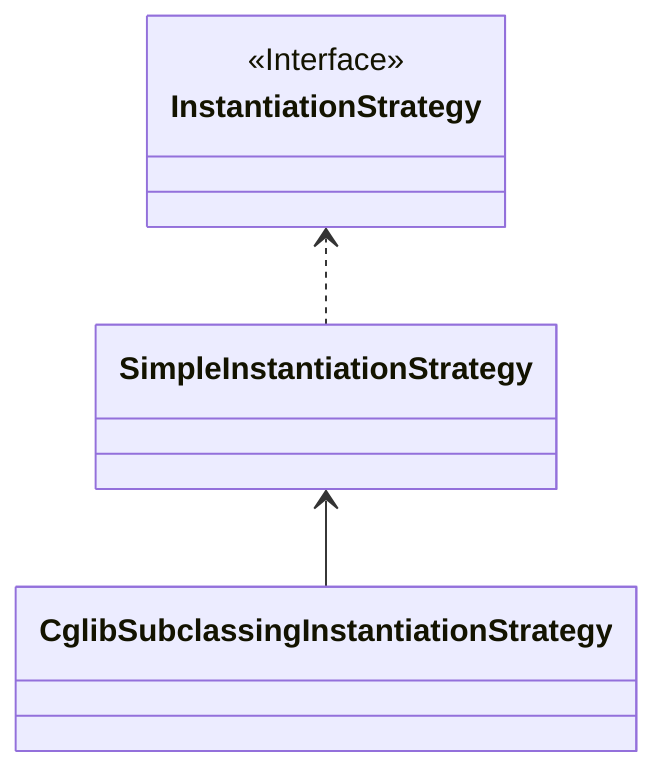

在 [Spring 源码解析：Bean 加载（二）](/posts/54dce9e15d4c) 中梳理了 createBean() 方法的主流程，本文则是其中创建实例部分的详解。

## BeanWrapper

看完上一篇博文后，可以明确的是，createBean() 方法直接拿到的不是 bean 实例，而是一个 BeanWrapper 对象。

```java
		BeanWrapper instanceWrapper = null;
		if (mbd.isSingleton()) {
			instanceWrapper = this.factoryBeanInstanceCache.remove(beanName);
		}
		if (instanceWrapper == null) {
			// 创建 bean 实例
			instanceWrapper = createBeanInstance(beanName, mbd, args);
		}
```

这里首先从 factoryBeanInstanceCache 中通过 beanName 获取对象实例，如果结果为 null，则说明未创建过，就调用 `#createBeanInstance()` 创建实例。

BeanWrapper 接口是有 BeanWrapperImpl 一个实现类，它持有最后创建的 bean 实例的引用，除此之外，还提供了操作 bean 实例的一些能力。

> Provides operations to analyze and manipulate standard JavaBeans: the ability to get and set property values (individually or in bulk), get property descriptors, and query the readability/writability of properties.
>
> 提供分析和操作标准 JavaBeans 的操作：获取和设置属性值（单独或批量）、获取属性描述符以及查询属性的可读性可写性的能力。
>
> ---- 摘自 Spring 源码 BeanWrapper 接口描述

## createBeanInstance()

```java
	protected BeanWrapper createBeanInstance(String beanName, RootBeanDefinition mbd, @Nullable Object[] args) {
		// Make sure bean class is actually resolved at this point.
		// 1. 获取 bean class
		Class<?> beanClass = resolveBeanClass(mbd, beanName);

		// 2. 如果类不是 public，且 BeanDefinition 不允许访问非 public 的构造方法，则直接报错
		if (beanClass != null && !Modifier.isPublic(beanClass.getModifiers()) && !mbd.isNonPublicAccessAllowed()) {
			throw new BeanCreationException(mbd.getResourceDescription(), beanName,
					"Bean class isn't public, and non-public access not allowed: " + beanClass.getName());
		}
		// 3. 尝试从 InstanceSupplier 中获取 bean
		Supplier<?> instanceSupplier = mbd.getInstanceSupplier();
		if (instanceSupplier != null) {
			return obtainFromSupplier(instanceSupplier, beanName);
		}

		// 4. 如果配置了工厂方法，就以工厂方法初始化
		if (mbd.getFactoryMethodName() != null) {
			return instantiateUsingFactoryMethod(beanName, mbd, args);
		}

		// Shortcut when re-creating the same bean...
		boolean resolved = false;
		boolean autowireNecessary = false;
		if (args == null) {
			// 如果有多个构造函数，需要根据参数锁定构造函数或者对应工厂方法
			synchronized (mbd.constructorArgumentLock) {
				// 这里如果 resolvedConstructorOrFactoryMethod 不为 null，
				// 说明是重复创建 bean，就能直接知道要使用的构造函数是哪一个
				if (mbd.resolvedConstructorOrFactoryMethod != null) {
					resolved = true;
					autowireNecessary = mbd.constructorArgumentsResolved;
				}
			}
		}
		// 5. 如果已经解析过，使用解析好的构造函数
		if (resolved) {
			// 是否需要构造器注入
			if (autowireNecessary) {
				// 构造器注入方式初始化
				return autowireConstructor(beanName, mbd, null, null);
			}
			else {
				// 使用默认构造器初始化
				return instantiateBean(beanName, mbd);
			}
		}

		// 6. 到这里就需要开始决策使用哪一个构造函数进行初始化
		Constructor<?>[] ctors = determineConstructorsFromBeanPostProcessors(beanClass, beanName);
		if (ctors != null || mbd.getResolvedAutowireMode() == AUTOWIRE_CONSTRUCTOR ||
				mbd.hasConstructorArgumentValues() || !ObjectUtils.isEmpty(args)) {
			// 构造器注入
			return autowireConstructor(beanName, mbd, ctors, args);
		}

		// Preferred constructors for default construction?
		// 7. 如果有优先使用的构造函数配置，则使用该构造函数
		ctors = mbd.getPreferredConstructors();
		if (ctors != null) {
			return autowireConstructor(beanName, mbd, ctors, null);
		}

		// 8. 使用默认构造器初始化，无参构造
		// No special handling: simply use no-arg constructor.
		return instantiateBean(beanName, mbd);
	}
```

1. 获取 bean class。
2. 如果类不是 public，且 BeanDefinition 不允许访问非 public 的构造方法，则直接报错。
3. 如果 BeanDefinition 中有提供 Supplier，则调用 `Supplier#get()` 方法获取 bean 实例。
4. 如果 BeanDefinition 的 factoryMethodName 不为空，说明是通过工厂创建的 bean，调用 `#instantiateUsingFactoryMethod（）` 方法进行 bean 的创建。
5. 第 5 步其实是对 bean 重复创建的场景的优化（比如 prototype 类型的 bean），第一次创建后，使用的构造方式、参数解析结果等都记录在了 BeanDefinition 中，第二次创建时可以直接使用，不用再重新解析。
6. 到了第六步说明只能使用构造函数进行创建，但是可能会有多个构造函数，这里需要通过 BeanPostProcessor 决定能使用的构造函数有哪些，如果最后得到的构造函数不为空，则调用 `#autowireConstructor()` 方法进行创建，并进行构造器注入。
7. 上一步未能得到能使用的构造函数，则判断 BeanDefinition 中是否指定了优先使用的构造函数，如果有，则使用该构造函数进行 bean 创建及构造器注入。
8. 最后的兜底操作，使用默认构造无参构造 `#instantiateBean()` 进行创建。

## Supplier 接口

Supplier 接口不是 Spring 定义的接口，而是 JDK 8 中定义的接口：

```java
@FunctionalInterface
public interface Supplier<T> {

    /**
     * Gets a result.
     *
     * @return a result
     */
    T get();
}
```

Supplier 接口只有一个 `#get()` 接口，也没有入参。

`@FunctionalInterface` 注解是函数式接口才会有的注解，有该注解时，会检查接口是否只有一个方法，但该注解并不是必须的。

很少看见有这种创建方式，不深究，主要知道 Supplier 接口怎么用就好。

## Bean 工厂

通过工厂方法创建 bean 的入口是 `#instantiateUsingFactoryMethod()` 方法，但是该方法内部也是调用了 `ConstructorResolver#instantiateUsingFactoryMethod()` 方法进行工厂方法的解析及 bean 创建。

> **前方高能预警**
>
> 下面 `#instantiateUsingFactoryMethod()` 方法的加注释快接近 300 行了，所以看起来比较吃力，主要知道它逻辑的主方向即可。
>
> 说实话这种大方法，在 Spring 里面太少见了，看吐了没，其实现在依然是没能理解透，但是也必要非的纠结如此细节的东西。

```java
	public BeanWrapper instantiateUsingFactoryMethod(
			String beanName, RootBeanDefinition mbd, @Nullable Object[] explicitArgs) {

		BeanWrapperImpl bw = new BeanWrapperImpl();
		this.beanFactory.initBeanWrapper(bw);

		Object factoryBean;
		Class<?> factoryClass;
		boolean isStatic;

		// 1. 获取工厂 bean 的 beanName
		String factoryBeanName = mbd.getFactoryBeanName();
		if (factoryBeanName != null) {
			if (factoryBeanName.equals(beanName)) {
				throw new BeanDefinitionStoreException(mbd.getResourceDescription(), beanName,
						"factory-bean reference points back to the same bean definition");
			}
			// 获取工厂 bean
			factoryBean = this.beanFactory.getBean(factoryBeanName);
			// 如果要创建的 bean 是单例的，但是 singletonObjects 中已经存在该 bean，就直接报错
			if (mbd.isSingleton() && this.beanFactory.containsSingleton(beanName)) {
				throw new ImplicitlyAppearedSingletonException();
			}
			// 注册bean依赖关系
			this.beanFactory.registerDependentBean(factoryBeanName, beanName);
			factoryClass = factoryBean.getClass();
			isStatic = false;
		}
		else {
			// It's a static factory method on the bean class.
			if (!mbd.hasBeanClass()) {
				throw new BeanDefinitionStoreException(mbd.getResourceDescription(), beanName,
						"bean definition declares neither a bean class nor a factory-bean reference");
			}
			// 静态工厂，需要提供工厂类的全类名
			factoryBean = null;
			factoryClass = mbd.getBeanClass();
			isStatic = true;
		}

		// 工厂方法的 Method 引用
		Method factoryMethodToUse = null;
		ArgumentsHolder argsHolderToUse = null;
		// 方法参数
		Object[] argsToUse = null;

		// 工厂方法参数，最初getBean()时传的，不为空的话，可以以此确定具体的工厂方法
		if (explicitArgs != null) {
			argsToUse = explicitArgs;
		}
		else {
			Object[] argsToResolve = null;
			// 从缓存中获取工厂方法的引用及参数
			synchronized (mbd.constructorArgumentLock) {
				factoryMethodToUse = (Method) mbd.resolvedConstructorOrFactoryMethod;
				if (factoryMethodToUse != null && mbd.constructorArgumentsResolved) {
					// Found a cached factory method...
					argsToUse = mbd.resolvedConstructorArguments;
					if (argsToUse == null) {
						argsToResolve = mbd.preparedConstructorArguments;
					}
				}
			}
			if (argsToResolve != null) {
				// 参数类型转换，比如：配置文件写的字面值是字符串，但实际上可能需要转换成int
				argsToUse = resolvePreparedArguments(beanName, mbd, bw, factoryMethodToUse, argsToResolve);
			}
		}

		if (factoryMethodToUse == null || argsToUse == null) {
			// Need to determine the factory method...
			// Try all methods with this name to see if they match the given arguments.
			factoryClass = ClassUtils.getUserClass(factoryClass);

			// 从工厂类中拿到的工厂方法
			List<Method> candidates = null;
			// 工厂方法是否唯一
			if (mbd.isFactoryMethodUnique) {
				if (factoryMethodToUse == null) {
					factoryMethodToUse = mbd.getResolvedFactoryMethod();
				}
				if (factoryMethodToUse != null) {
					candidates = Collections.singletonList(factoryMethodToUse);
				}
			}
			if (candidates == null) {
				candidates = new ArrayList<>();
				// 通过反射获取工厂类中的方法：如果允许访问私有方法则获取所有方法，否则只获取public的方法
				Method[] rawCandidates = getCandidateMethods(factoryClass, mbd);
				for (Method candidate : rawCandidates) {
					if (Modifier.isStatic(candidate.getModifiers()) == isStatic && mbd.isFactoryMethod(candidate)) {
						candidates.add(candidate);
					}
				}
			}

			// 得到的工厂方法只有一个，且参数为空，且BeanDefinition中定义的工厂方法也没有参数
			// 就能确定具体的工厂方法
			if (candidates.size() == 1 && explicitArgs == null && !mbd.hasConstructorArgumentValues()) {
				Method uniqueCandidate = candidates.get(0);
				if (uniqueCandidate.getParameterCount() == 0) {
					mbd.factoryMethodToIntrospect = uniqueCandidate;
					synchronized (mbd.constructorArgumentLock) {
						mbd.resolvedConstructorOrFactoryMethod = uniqueCandidate;
						mbd.constructorArgumentsResolved = true;
						mbd.resolvedConstructorArguments = EMPTY_ARGS;
					}
					// 创建实例
					bw.setBeanInstance(instantiate(beanName, mbd, factoryBean, uniqueCandidate, EMPTY_ARGS));
					return bw;
				}
			}
			// 获取的工厂方法个数不唯一，先进行排序
			if (candidates.size() > 1) {  // explicitly skip immutable singletonList
				candidates.sort(AutowireUtils.EXECUTABLE_COMPARATOR);
			}

			ConstructorArgumentValues resolvedValues = null;
			boolean autowiring = (mbd.getResolvedAutowireMode() == AutowireCapableBeanFactory.AUTOWIRE_CONSTRUCTOR);
			int minTypeDiffWeight = Integer.MAX_VALUE;
			Set<Method> ambiguousFactoryMethods = null;

			// 构架bean所需要的参数个数
			int minNrOfArgs;
			if (explicitArgs != null) {
				minNrOfArgs = explicitArgs.length;
			}
			else {
				// We don't have arguments passed in programmatically, so we need to resolve the
				// arguments specified in the constructor arguments held in the bean definition.
				if (mbd.hasConstructorArgumentValues()) {
					// 从 BeanDefinition 中取
					ConstructorArgumentValues cargs = mbd.getConstructorArgumentValues();
					resolvedValues = new ConstructorArgumentValues();
					minNrOfArgs = resolveConstructorArguments(beanName, mbd, bw, cargs, resolvedValues);
				}
				else {
					minNrOfArgs = 0;
				}
			}

			Deque<UnsatisfiedDependencyException> causes = null;

			// 开始循环前面得到的方法列表
			for (Method candidate : candidates) {
				int parameterCount = candidate.getParameterCount();
				// 如果方法参数数量小于minNrOfArgs，则直接跳过
				if (parameterCount >= minNrOfArgs) {
					ArgumentsHolder argsHolder;

					Class<?>[] paramTypes = candidate.getParameterTypes();
					if (explicitArgs != null) {
						// Explicit arguments given -> arguments length must match exactly.
						// 如果 explicitArgs 参数不为null,则工厂方法的参数个数必须和explicitArgs一致，否则直接跳过
						// spring启动时，调用getBean()一般传的null
						if (paramTypes.length != explicitArgs.length) {
							continue;
						}
						argsHolder = new ArgumentsHolder(explicitArgs);
					}
					else {
						// Resolved constructor arguments: type conversion and/or autowiring necessary.
						try {
							String[] paramNames = null;
							ParameterNameDiscoverer pnd = this.beanFactory.getParameterNameDiscoverer();
							if (pnd != null) {
								paramNames = pnd.getParameterNames(candidate);
							}
							// 创建方法参数数组
							argsHolder = createArgumentArray(beanName, mbd, resolvedValues, bw,
									paramTypes, paramNames, candidate, autowiring, candidates.size() == 1);
						}
						catch (UnsatisfiedDependencyException ex) {
							if (logger.isTraceEnabled()) {
								logger.trace("Ignoring factory method [" + candidate + "] of bean '" + beanName + "': " + ex);
							}
							// Swallow and try next overloaded factory method.
							if (causes == null) {
								causes = new ArrayDeque<>(1);
							}
							causes.add(ex);
							continue;
						}
					}

					// 参数类型的差异权重
					// isLenientConstructorResolution 表示是否按宽松模式解析构造函数，默认为true
					int typeDiffWeight = (mbd.isLenientConstructorResolution() ?
							argsHolder.getTypeDifferenceWeight(paramTypes) : argsHolder.getAssignabilityWeight(paramTypes));
					// Choose this factory method if it represents the closest match.
					// 获取差异权重最小的工厂方法
					if (typeDiffWeight < minTypeDiffWeight) {
						factoryMethodToUse = candidate;
						argsHolderToUse = argsHolder;
						argsToUse = argsHolder.arguments;
						minTypeDiffWeight = typeDiffWeight;
						ambiguousFactoryMethods = null;
					}
					// Find out about ambiguity: In case of the same type difference weight
					// for methods with the same number of parameters, collect such candidates
					// and eventually raise an ambiguity exception.
					// However, only perform that check in non-lenient constructor resolution mode,
					// and explicitly ignore overridden methods (with the same parameter signature).
					else if (factoryMethodToUse != null && typeDiffWeight == minTypeDiffWeight &&
							!mbd.isLenientConstructorResolution() &&
							paramTypes.length == factoryMethodToUse.getParameterCount() &&
							!Arrays.equals(paramTypes, factoryMethodToUse.getParameterTypes())) {
						if (ambiguousFactoryMethods == null) {
							ambiguousFactoryMethods = new LinkedHashSet<>();
							ambiguousFactoryMethods.add(factoryMethodToUse);
						}
						ambiguousFactoryMethods.add(candidate);
					}
				}
			}

			if (factoryMethodToUse == null || argsToUse == null) {
				if (causes != null) {
					// 解析失败，抛异常
					UnsatisfiedDependencyException ex = causes.removeLast();
					for (Exception cause : causes) {
						this.beanFactory.onSuppressedException(cause);
					}
					throw ex;
				}
				List<String> argTypes = new ArrayList<>(minNrOfArgs);
				if (explicitArgs != null) {
					for (Object arg : explicitArgs) {
						argTypes.add(arg != null ? arg.getClass().getSimpleName() : "null");
					}
				}
				else if (resolvedValues != null) {
					Set<ValueHolder> valueHolders = new LinkedHashSet<>(resolvedValues.getArgumentCount());
					valueHolders.addAll(resolvedValues.getIndexedArgumentValues().values());
					valueHolders.addAll(resolvedValues.getGenericArgumentValues());
					for (ValueHolder value : valueHolders) {
						String argType = (value.getType() != null ? ClassUtils.getShortName(value.getType()) :
								(value.getValue() != null ? value.getValue().getClass().getSimpleName() : "null"));
						argTypes.add(argType);
					}
				}
				String argDesc = StringUtils.collectionToCommaDelimitedString(argTypes);
				throw new BeanCreationException(mbd.getResourceDescription(), beanName,
						"No matching factory method found: " +
						(mbd.getFactoryBeanName() != null ?
							"factory bean '" + mbd.getFactoryBeanName() + "'; " : "") +
						"factory method '" + mbd.getFactoryMethodName() + "(" + argDesc + ")'. " +
						"Check that a method with the specified name " +
						(minNrOfArgs > 0 ? "and arguments " : "") +
						"exists and that it is " +
						(isStatic ? "static" : "non-static") + ".");
			}
			else if (void.class == factoryMethodToUse.getReturnType()) {
				throw new BeanCreationException(mbd.getResourceDescription(), beanName,
						"Invalid factory method '" + mbd.getFactoryMethodName() +
						"': needs to have a non-void return type!");
			}
			else if (ambiguousFactoryMethods != null) {
				throw new BeanCreationException(mbd.getResourceDescription(), beanName,
						"Ambiguous factory method matches found in bean '" + beanName + "' " +
						"(hint: specify index/type/name arguments for simple parameters to avoid type ambiguities): " +
						ambiguousFactoryMethods);
			}

			if (explicitArgs == null && argsHolderToUse != null) {
				mbd.factoryMethodToIntrospect = factoryMethodToUse;
				argsHolderToUse.storeCache(mbd, factoryMethodToUse);
			}
		}
		// 创建bean实例
		bw.setBeanInstance(instantiate(beanName, mbd, factoryBean, factoryMethodToUse, argsToUse));
		return bw;
	}
```

这个方法虽然庞大，整体的处理流程如下：

1. 获取 FactoryBeanName，如果 FactoryBeanName 不为空，说明创建 bean 的工厂也是一个 Spring 托管的 bean，否则就只能是一个静态工厂，且必须提供全类名。
2. 获取工厂方法。
   1. 首先同样是对重复创建 bean 的优化，从缓存中取。
   2. 参数类型转换。这里需要注意方法参数 `explicitArgs`，从 bean 创建流程上看，该参数是从最开始调用 `#getBean()` 方法时传的，则该参数必定为 null，此时还需要做参数解析，对于 `argToUse` 变量。`#resolvePreparedArguments()` 方法用于类型转换，具体的可能是将配置文件中的字面值转换成 Integer、Long 等类似的工作。
   3. 和 factoryBeanName 同名的方法可能会有多个，通过参数个数、参数类型偏差等，决定使用哪个工厂方法进行 bean 创建。
3. 创建 bean 实例，这里是调用 `#instantiate()` 方法。

### instantiate 方法

```java
	private Object instantiate(String beanName, RootBeanDefinition mbd,
			@Nullable Object factoryBean, Method factoryMethod, Object[] args) {

		try {
			if (System.getSecurityManager() != null) {
				return AccessController.doPrivileged((PrivilegedAction<Object>) () ->
						this.beanFactory.getInstantiationStrategy().instantiate(
								mbd, beanName, this.beanFactory, factoryBean, factoryMethod, args),
						this.beanFactory.getAccessControlContext());
			}
			else {
				return this.beanFactory.getInstantiationStrategy().instantiate(
						mbd, beanName, this.beanFactory, factoryBean, factoryMethod, args);
			}
		}
		catch (Throwable ex) {
			throw new BeanCreationException(mbd.getResourceDescription(), beanName,
					"Bean instantiation via factory method failed", ex);
		}
	}
```

这里又是将实例化的工作委托给了 `InstantiationStrategy#instantiate(RootBeanDefinition,String,BeanFactory,Object,Method,Object...)` 方法。

InstantiationStrategy 有两个实现，但是只有 SimpleInstantiationStrategy 实现了该方法，而 CglibSubclassingInstantiationStrategy 实现类则是直接继承了 SimpleInstantiationStrategy。



而方案里面其实就是通过反射调用 FactoryMethod 得到 bean 实例了。

## 总结

* 创建 bean 的方式有多种，但是从上述逻辑看，不同的方式存在优先级关系：
  1. 通过 Supplier 接口创建。
  2. 通过工厂方法创建。
  3. 使用 BeanPostProcessor 决定的构造函数进行创建。
  4. 使用 BeanDefinition 中定义的优先使用的构造函数进行创建。
  5. 使用默认的无参构造函数进行创建。

* 对于使用构造函数创建的，主要有 `#autowireConstructor()` 、`#instantiateBean()` 两个方法
  * autowireConstructor 能够进行构造器注入的操作。
  * instantiateBean 方法则是使用无参构造进行创建。

本文只讲到了使用 Supplier、工厂方法进行创建，其余的方式将在后后续博文中继续讲解没，篇幅太长了也不好。
