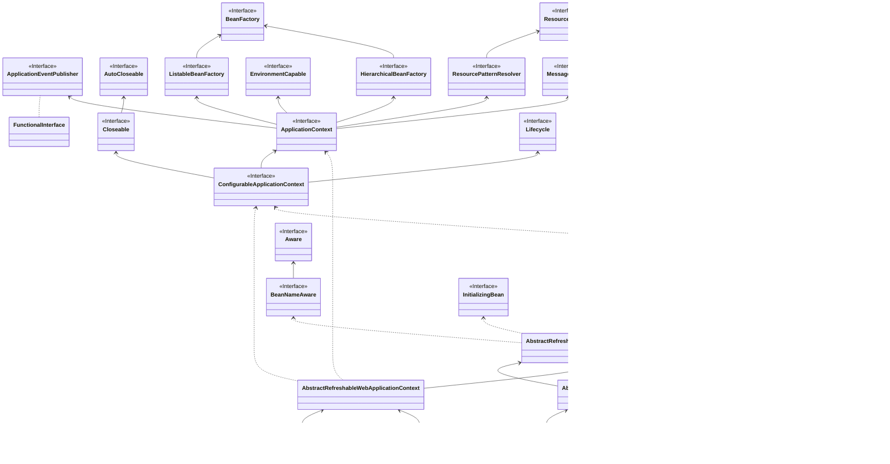

## IOC 容器

IOC 全程 Inversion Of Control，可翻译控制反转，其最显著的功能是依赖注入。

在没有 IOC 的情况下，在对象 A 中要使用对象 B，那对象 A 就必须要显示的运行一次 B 的实例化过程，换句话讲 A 必须知道要如何实例化一个对象 B。

有了 IOC 之后，A 对象只需要告诉 IOC 容器，需要一个 B 对象，而 B 的实例化过程交给 IOC 容器去做，换言之，IOC 控制了对象的生命周期。

那么，IOC 所谓的**控制反转**，其实就是指在使用 IOC 容器之后，对象都交由 IOC 容器去控制，进一步，对象的创建不再是在依赖的地方自己去创建，而是需要的时候从 IOC 容器中获取。

而依赖注入，其实就是将从 IOC 获取对象这一步也进行简化。以上面的例子来讲，如果 A、B 都是交由 IOC 容器管理的对象，A 获取 B 对象并不是在自己的代码中显式调用一个 IocContainer.get(B.class) 来获取，而只需要在自己的类中声明自己需要一个属性，类型是 B，而这个属性的赋值，也交给了 IOC 容器做。

> 这样讲，是不是就发现和日常使用 Spring 的操作模式很像了，毕竟 Spring 本身就维护了一个 IOC 容器。

## 初始化流程的抽象设计

> 这里不会很细节的讲整个流程，而只是梳理流程都有哪些节点，每个节点会有一篇单独的讲解。

下面是摘自 spring 源码中的测试代码：

```java
	private static final String PATH = "/org/springframework/context/support/";
	private static final String FQ_SIMPLE_CONTEXT = PATH + "simpleContext.xml";
	@Test
	public void testSingleConfigLocation() {
		ClassPathXmlApplicationContext ctx = new ClassPathXmlApplicationContext(FQ_SIMPLE_CONTEXT);
		ctx.getBean("someMessageSource");
		assertThat(ctx.containsBean("someMessageSource")).isTrue();
		ctx.close();
	}
```

可以看见这里初始化 ClassPathXmlApplicationContext 时是传入的一个 xml 配置文件。

那么，按照一般理解，得到 xml 配置文件之后，需要做的事至少有以下 3 步：

1. 加载配置文件
2. 解析配置文件
3. 根据配置实例化对象

而众所周知，Spring 还维护了一个 IOC 容器，所以除了上面 3 步以外，还需要一个 IOC 容器来管理实例化的对象。

上述这些加载、解析配置，实例化对象，将对象交由 IOC 管理等一系列我们知道或不知道的操作，还需要一个统一的地方来进行编排，而这在 Spring 中对应的就是 ClassPathXmlApplicationContext 等一系列的 ApplicationContext。

加载配置，因为配置文件不一定非得是 xml 格式的，甚至不一定是本地的资源文件，所以 Spring 对资源进行抽象，形成 Resource 接口，而 Resource 只是配置资源，每种资源又对应了不同的 Resourceloader 接口实现类来加载。

解析配置，同样也是因为资源类型的不同，所以又有了 BeanDefinitionReader 接口来定义不同资源的解析过程。

实例化对象，和想象就有点不一样了，因为按照一般的流水账式的设计，肯定是边解析配置，就一边将对象实例化了，但是 Spring 需要考虑的情况太多了，所以需要一个更具扩展性的设计，比如要实现 AOP，如果要变解析边实例化，那 AOP 代理时就直接乱套了。所以 Spring 在解析配置时，只是解析出了 Bean 的定义描述信息，即 BeanDefinition。所以，当解析完文件，实例化对象的过程应是：

1. 根据 BeanDefinition 先初始化一个 bean 的对象
2. 填充依赖对象

那么上述过程设计的基本接口有：

配置资源加载：

* Resource
* Resourceloader

配置资源解析：

* BeanDefinitionReader

IOC 容器：

* BeanFactory

初始化流程编排，应用上下文：

* ApplicationContext

### ApplicationContext



上面是 ApplicationContext 的类图，会发现它还继承了 BeanFactory 接口和 ResourceLoader 接口。

其实 ApplicationContext 本身就是一个 IOC 容器，但是又不只是一个 IOC 容器，它还具备以下能力：

1. 实现 ResourceLoader 接口，具备加载资源的能力。
2. 实现 MessageSource 接口，提供了国际化访问的能力。
3. 实现 ApplicationEventPublisher 接口，提供了事件发布的能力。
4. 从类图中也能发现，对 web 应用的支持，并不是 IOC 原生的能力，也是 ApplicationContext 扩展实现的能力。
