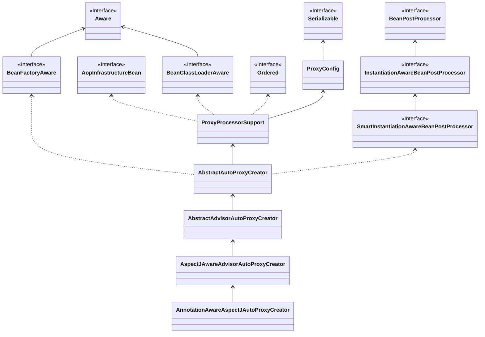

本来是要写循环依赖的，但是写着写着才想起都没讲解 AOP，那循环依赖就没饭讲得比较透彻了，所以先讲 AOP 的体系梳理一遍。

# AOP

## AOP 核心概念

* Aspect

  其实就是一个用来实现 AOP 的模块。Spring AOP 中要么通过 XML schema 指定的类或者直接通过 `@Aspect` 注解来实现。

* Join point

  连接点，在程序运行过程中进行增强的点，比如在 Spring 中的某个方法。

* Advice

  在某个特定的连接点的切入方式。这样说其实有点难理解，其实就是日常使用切面时，常常需要注意的 `around`、`before`、`after` 这三种切入形式。

* Pointcut

  断言 Join point 是否匹配。advice 会关联一个 Pointcut 表达式，并通过 Pointcut 匹配所有 Join point，这个动作是 AOP 的核心概念。

* Introduction

  可以为类型额外声明方法或者属性。Spring AOP 能让你为任意的被 Advice 处理过的类增加实现接口。

* Target object

  被一个或多个 Advice 处理后的对象，Spring 中一般使用动态代理，所以 Target Object 肯定是代理对象。

* AOP proxy

  为了实现 AOP 契约，通过 AOP 框架创建的对象。Spring 中 AOP proxy 都是通过 Jdk 动态代理或者 Cglib 创建的。

* Weaving

  用于链接 aspects 和其他应用程序或类型，用于创建 Target Object。它可以在编译时、加载时、运行时完成。Spring AOP 和其他纯 Java 的 AOP 框架一样，都是在运行时进行这一步。

Spring 中，Advice 还细分为了下面 5 种：

1. Before Advice，在 Join point 之前执行 Advice，除非抛出了一场，不然不会阻断流程到达 Join point。
2. After returning advice，通常是在 Join point 执行完全完成之后执行 Advice（比如方法不抛异常而正常返回后）。
3. After throwing advice，在 Join point 对应的方法因异常而退出时执行 Advice。
4. After advice，不管是正常返回还是方法异常退出，都一定会在之后执行 Advice，这就和 finally 关键一样。
5. Around advice，包围整个 Join point 的执行，可以在执行前、后都加上一些自定义的操作。

## Pointcut

* execution，这个其实就是用来匹配 Join point，Spring 中常用的主要就是它。
* @annottion，用于匹配有指定注解的 Join point。

> **Notice**
>
> 其实关键字还有很多，但这里就不赘述，这里主要介绍一下 Pointcut 表达式常用的几个关键字。

## 代理机制

前面说到，Spring 中动态代理有两种方式：一种是 JDK 动态代理，由 JDK 原生提供；一种是 Cglib，是一个开源的字节码生成器项目，在 spring-core 中重新封装了一次后使用。

在 Spring 中，默认的规则是：如果代理对象实现了多个接口，则使用 JDK 动态代理，如果没有实现任何接口，则使用 Cglib。如果在 Spring 中要强制使用 Cglib，可以将 `<aop:config>` 标签的 `proxy-target-class` 属性设置为 true。如果是在使用 @AspectJ 时要强制使用 Cglib，则需要设置 `<aop:aspectj-autoproxy>` 标签的 `proxy-target-class` 属性为 true。

> `<aop:config>`、`<aop:aspectj-autoproxy>` 有什么区别？后面讲。

但是，Cglib 对 final 关键字修饰的方法是没办法进行代理的。

# Spring AOP

在官方文档里面介绍了很多 Spring AOP 的重要接口，为了方便理解，这里就不直接一个个介绍接口，接下来会从 Spring IOC 容器启动过程中 AOP 相关逻辑入手，一步步进行解释。

首先，我们知道在 Spring 中要启用 AspectJ，可以通过 xml 配置文件开启，另一种方式则是可以通过在配置类上增加 `@EnableAspectJAutoProxy` 注解实现，这两种其实都差不多，这里以 xml 方式开始深入其原理。

## AOP 标签解析

如果还记得最开始学习 Spring 时是如何在 xml 文件里面配置 AOP 的话，应该就知道，AOP 相关的标签并不在 Spring 的默认命名空间里面，而是需要单独引入，属于自定义标签，只不过是 Spring 已经实现了。

在[Spring 源码解析：自定义标签](/posts/163184d50150)一文中，有提到，自定义标签需要实现 NamespaceHandlerSupport 抽象类，AOP 对应的实现类就是 `AopNamespaceHandler`：

```java
public class AopNamespaceHandler extends NamespaceHandlerSupport {

	/**
	 * Register the {@link BeanDefinitionParser BeanDefinitionParsers} for the
	 * '{@code config}', '{@code spring-configured}', '{@code aspectj-autoproxy}'
	 * and '{@code scoped-proxy}' tags.
	 */
	@Override
	public void init() {
		// In 2.0 XSD as well as in 2.5+ XSDs
		registerBeanDefinitionParser("config", new ConfigBeanDefinitionParser());
		registerBeanDefinitionParser("aspectj-autoproxy", new AspectJAutoProxyBeanDefinitionParser());
		registerBeanDefinitionDecorator("scoped-proxy", new ScopedProxyBeanDefinitionDecorator());

		// Only in 2.0 XSD: moved to context namespace in 2.5+
		registerBeanDefinitionParser("spring-configured", new SpringConfiguredBeanDefinitionParser());
	}

}

```

## aop:aspectj-autoproxy 标签解析

我们直接看 aspectj-autoproxy 对应的 AspectJAutoProxyBeanDefinitionParser 的 parse() 方法：

```java
	@Override
	@Nullable
	public BeanDefinition parse(Element element, ParserContext parserContext) {
		AopNamespaceUtils.registerAspectJAnnotationAutoProxyCreatorIfNecessary(parserContext, element);
		extendBeanDefinition(element, parserContext);
		return null;
	}
```

这里有两步，第一步主要是为了注册 `AnnotationAwareAspectJAutoProxyCreator` 这个 bean，这算是 AOP 这个功能一切的开始；第二步则是解析 `aspectj-autoproxy` 标签的子标签。

这里主要关注第一步，也就是 `AopNamespaceUtils.registerAspectJAnnotationAutoProxyCreatorIfNecessary()` 方法。

```java
	public static void registerAspectJAnnotationAutoProxyCreatorIfNecessary(
			ParserContext parserContext, Element sourceElement) {
		// 注册 AnnotationAwareAspectJAutoProxyCreator
		BeanDefinition beanDefinition = AopConfigUtils.registerAspectJAnnotationAutoProxyCreatorIfNecessary(
				parserContext.getRegistry(), parserContext.extractSource(sourceElement));
		// 处理 proxy-target-class 属性和 expose-proxy 属性
		useClassProxyingIfNecessary(parserContext.getRegistry(), sourceElement);
		// 注册组件
		registerComponentIfNecessary(beanDefinition, parserContext);
	}
```

同样只关注 `AnnotationAwareAspectJAutoProxyCreator` 的注册。

```java
	private static final List<Class<?>> APC_PRIORITY_LIST = new ArrayList<>(3);

	static {
		// Set up the escalation list...
		APC_PRIORITY_LIST.add(InfrastructureAdvisorAutoProxyCreator.class);
		APC_PRIORITY_LIST.add(AspectJAwareAdvisorAutoProxyCreator.class);
		APC_PRIORITY_LIST.add(AnnotationAwareAspectJAutoProxyCreator.class);
	}	

	@Nullable
	public static BeanDefinition registerAspectJAnnotationAutoProxyCreatorIfNecessary(
			BeanDefinitionRegistry registry, @Nullable Object source) {

		return registerOrEscalateApcAsRequired(AnnotationAwareAspectJAutoProxyCreator.class, registry, source);
	}	

	@Nullable
	private static BeanDefinition registerOrEscalateApcAsRequired(
			Class<?> cls, BeanDefinitionRegistry registry, @Nullable Object source) {

		Assert.notNull(registry, "BeanDefinitionRegistry must not be null");

		// AUTO_PROXY_CREATOR_BEAN_NAME = org.springframework.aop.config.internalAutoProxyCreator
		// 先判断 beanDefinition 是否存在
		if (registry.containsBeanDefinition(AUTO_PROXY_CREATOR_BEAN_NAME)) {
			// 如果已经存在，则拿到已经存在 BeanDefinition 和当前要注册的 beanClass 比较
			BeanDefinition apcDefinition = registry.getBeanDefinition(AUTO_PROXY_CREATOR_BEAN_NAME);
			if (!cls.getName().equals(apcDefinition.getBeanClassName())) {
				// 不是同一个 class, 则比较优先级，数字越大，优先级越高
				int currentPriority = findPriorityForClass(apcDefinition.getBeanClassName());
				int requiredPriority = findPriorityForClass(cls);
				if (currentPriority < requiredPriority) {
					apcDefinition.setBeanClassName(cls.getName());
				}
			}
			return null;
		}
		RootBeanDefinition beanDefinition = new RootBeanDefinition(cls);
		beanDefinition.setSource(source);
		beanDefinition.getPropertyValues().add("order", Ordered.HIGHEST_PRECEDENCE);
		// 设置 bean 的 role 为 spring 基础设施类的 bean
		beanDefinition.setRole(BeanDefinition.ROLE_INFRASTRUCTURE);
		// 注册 beanDefinition
		registry.registerBeanDefinition(AUTO_PROXY_CREATOR_BEAN_NAME, beanDefinition);
		return beanDefinition;
	}

	private static int findPriorityForClass(@Nullable String className) {
		for (int i = 0; i < APC_PRIORITY_LIST.size(); i++) {
			Class<?> clazz = APC_PRIORITY_LIST.get(i);
			if (clazz.getName().equals(className)) {
				return i;
			}
		}
		throw new IllegalArgumentException(
				"Class name [" + className + "] is not a known auto-proxy creator class");
	}
```

从代码逻辑上看，AOP 功能的开启并非必须使用 `AnnotationAwareAspectJAutoProxyCreator`，根据环境的不同，可能也会注册成其他的类，不过 beanName 都是 `org.springframework.aop.config.internalAutoProxyCreator`。

对于这个 beanName 已经注册的情况，则取出已注册的 BeanDefinition 的 class，对比两个 class 在 APC_PRIORITY_LIST 中的优先级，在 APC_PRIORITY_LIST 中越往后的优先级越高。

> 前面讲到 AOP 标签解析的 AopNamespaceHandler 时，代码中有一个 config 标签的解析，解析时会注册 `AspectJAwareAdvisorAutoProxyCreator` 类的 BeanDefinition，beanName 也是 `org.springframework.aop.config.internalAutoProxyCreator`，那么逻辑上看，如果同时使用了 config、aspectj-autoproxy，那么最终注册的其实是 `AnnotationAwareAspectJAutoProxyCreator`。

## AnnotationAwareAspectJAutoProxyCreator 类

### 类继承结构

我们看看 AnnotationAwareAspectJAutoProxyCreator 这个类的继承结构。



这张图需要注意的有 2 点：

1. AnnotationAwareAspectJAutoProxyCreator 继承自 AspectJAwareAdvisorAutoProxyCreator，从命名上看，前者主要是支持了注解方式的 AOP。
2. AnnotationAwareAspectJAutoProxyCreator 实现了 BeanPostProcessor 接口，BeanPostProcessor 是 Spring 提供的一个用于自定义修改 bean 实例的扩展接口，AOP 其实就是通过这个机制生效的。

在初始化 bean 之前，会调用 BeanPostProcessor 的 postProcessBeforeInitialization() 方法，初始化后会调用 postProcessAfterInitialization() 方法。

```java
public interface BeanPostProcessor {

	@Nullable
	default Object postProcessBeforeInitialization(Object bean, String beanName) throws BeansException {
		return bean;
	}

	@Nullable
	default Object postProcessAfterInitialization(Object bean, String beanName) throws BeansException {
		return bean;
	}
}
```

### 注册 BeanPostProcessor

BeanPostProcessor 的 bean 是在 bean 加载时注册到 beanPostProcessor 的列表中的。

在 Spring 容器初始化过程中，调用了一个 refresh() 方法。

```java
	public ClassPathXmlApplicationContext(
			String[] configLocations, boolean refresh, @Nullable ApplicationContext parent)
			throws BeansException {

		super(parent);
		setConfigLocations(configLocations);
		if (refresh) {
			refresh();
		}
	}

```

> refresh() 方法并不是只有 ClassPathXmlApplicationContext 在调用，这里只是以 ClassPathXmlApplicationContext 举例。

refresh() 中就是整个 Spring 启动的流程了，其中有调用 `registerBeanPostProcessors()` 方法用于注册 BeanPostProcessor，这里不展开将，后面开一篇新的博文专门讲 BeanPostProcessor。

这个方法主要是讲所有 BeanPostProcessor 的实现类都拿到，并调用 getBean() 方法进行了实例化、初始化，然后将 bean 注册到了 `AbstractBeanFactory` 的 beanPostProcessors 中，后面具体使用的时候还会根据实现类所实现或继承的某些特殊的接口或类做过滤后使用。

### 获取代理实例

这里直接看 `AbstractAutoProxyCreator#wrapIfNecessary()` 方法。

```java
	protected Object wrapIfNecessary(Object bean, String beanName, Object cacheKey) {
		// 检查 beanName 和缓存
		if (StringUtils.hasLength(beanName) && this.targetSourcedBeans.contains(beanName)) {
			return bean;
		}
		// 获取 bean 对应的增强规则，如果没有，说明不需要增强
		if (Boolean.FALSE.equals(this.advisedBeans.get(cacheKey))) {
			return bean;
		}
		// 是否是spring的基础设施 bean，或者需要直接忽略
		if (isInfrastructureClass(bean.getClass()) || shouldSkip(bean.getClass(), beanName)) {
			this.advisedBeans.put(cacheKey, Boolean.FALSE);
			return bean;
		}

		// 获取 advisor
		Object[] specificInterceptors = getAdvicesAndAdvisorsForBean(bean.getClass(), beanName, null);
		if (specificInterceptors != DO_NOT_PROXY) {
			this.advisedBeans.put(cacheKey, Boolean.TRUE);
      // 创建代理
			Object proxy = createProxy(
					bean.getClass(), beanName, specificInterceptors, new SingletonTargetSource(bean));
			this.proxyTypes.put(cacheKey, proxy.getClass());
			return proxy;
		}

		this.advisedBeans.put(cacheKey, Boolean.FALSE);
		return bean;
	}
```

1. 首先是一些前置检查，是否需要代理。
2. 获取 Advisor。
3. 创建代理类。

#### 获取所有 Advisor

根据当前 bean 的 Class 和 beanName 获取增强的 Advisor。

> 因为这里执行的 BeanPostProcessor 实例是 AnnotationAwareAspectJAutoProxyCreator，从该类的继承结构看，这里调用的 getAdvicesAndAdvisorsForBean() 方法在 AbstractAdvisorAutoProxyCreator 抽象类中。

```java
	protected Object[] getAdvicesAndAdvisorsForBean(
			Class<?> beanClass, String beanName, @Nullable TargetSource targetSource) {

		List<Advisor> advisors = findEligibleAdvisors(beanClass, beanName);
		if (advisors.isEmpty()) {
			return DO_NOT_PROXY;
		}
		return advisors.toArray();
	}
```

这里就是通过 beanClass 和 beanName 获取符合条件的 Advisor 实例，然后就直接返回了。

这里需要解释一下的是， advisor 这个概念在前面介绍 AOP 概念时是没提到的。advisor 是 Spring 实现 AOP 时用于维护 advice 和 pointcut 的关系而建立的一类接口。

> In Spring, an Advisor is an aspect that contains only a single advice object associated with a pointcut expression.

```java
	protected List<Advisor> findEligibleAdvisors(Class<?> beanClass, String beanName) {
		// 先获取所有 Advisor
		List<Advisor> candidateAdvisors = findCandidateAdvisors();
		// 过滤得到可以用在当前bean上的 Advisor
		List<Advisor> eligibleAdvisors = findAdvisorsThatCanApply(candidateAdvisors, beanClass, beanName);
		extendAdvisors(eligibleAdvisors);
		if (!eligibleAdvisors.isEmpty()) {
			// 排序
			eligibleAdvisors = sortAdvisors(eligibleAdvisors);
		}
		return eligibleAdvisors;
	}
```

这里就很简单了，先获取所有 Advisor，然后再过滤得到可以用在当前 bean 上的 Advisor。

先看获取所有 Advisor：

```java
// AnnotationAwareAspectJAutoProxyCreator
	@Override
	protected List<Advisor> findCandidateAdvisors() {
		// 通过父类获取直接实现 Advisor 接口的 bean
		List<Advisor> advisors = super.findCandidateAdvisors();
		// Build Advisors for all AspectJ aspects in the bean factory.
		if (this.aspectJAdvisorsBuilder != null) {
			// 构建 Advisor,这里主要是寻找使用 @Aspect 注解的 bean
			advisors.addAll(this.aspectJAdvisorsBuilder.buildAspectJAdvisors());
		}
		return advisors;
	}
```

Advisor 有两种来源，一种是直接实现 Advisor 接口的 bean 实例，一种是使用 `@Aspect` 注解的 bean，这里关注使用 `@Aspect` 注解的方法。

```java
	public List<Advisor> buildAspectJAdvisors() {
		// aspectBeanNames 缓存
		List<String> aspectNames = this.aspectBeanNames;

		if (aspectNames == null) {
			// 如果未null，则开始加载
			synchronized (this) {
				aspectNames = this.aspectBeanNames;
				if (aspectNames == null) {
					List<Advisor> advisors = new ArrayList<>();
					aspectNames = new ArrayList<>();
					// 获取所有 bean,所以这里传入的 bean 类型是 Object
					String[] beanNames = BeanFactoryUtils.beanNamesForTypeIncludingAncestors(
							this.beanFactory, Object.class, true, false);
					for (String beanName : beanNames) {
						// 默认环境下isEligibleBean()基本都是返回true
						if (!isEligibleBean(beanName)) {
							continue;
						}
						// We must be careful not to instantiate beans eagerly as in this case they
						// would be cached by the Spring container but would not have been weaved.
						// 通过 beanName 获取 beanClass
						Class<?> beanType = this.beanFactory.getType(beanName, false);
						if (beanType == null) {
							continue;
						}
						// 通过 beanClass 判断是否是 Aspect 实现
						if (this.advisorFactory.isAspect(beanType)) {
							aspectNames.add(beanName);
							AspectMetadata amd = new AspectMetadata(beanType, beanName);
							// 是否是单例模式
							if (amd.getAjType().getPerClause().getKind() == PerClauseKind.SINGLETON) {
								// 构建 advisor 实例
								MetadataAwareAspectInstanceFactory factory =
										new BeanFactoryAspectInstanceFactory(this.beanFactory, beanName);
								List<Advisor> classAdvisors = this.advisorFactory.getAdvisors(factory);
								if (this.beanFactory.isSingleton(beanName)) {
									// 如果是单例模式 bean，则放入 advisorCache
									this.advisorsCache.put(beanName, classAdvisors);
								}
								else {
									// 如果不是单例 bean，则放入 aspectFactoryCache
									this.aspectFactoryCache.put(beanName, factory);
								}
								advisors.addAll(classAdvisors);
							}
							else {
								// Per target or per this.
								if (this.beanFactory.isSingleton(beanName)) {
									throw new IllegalArgumentException("Bean with name '" + beanName +
											"' is a singleton, but aspect instantiation model is not singleton");
								}
								MetadataAwareAspectInstanceFactory factory =
										new PrototypeAspectInstanceFactory(this.beanFactory, beanName);
								this.aspectFactoryCache.put(beanName, factory);
								advisors.addAll(this.advisorFactory.getAdvisors(factory));
							}
						}
					}
					this.aspectBeanNames = aspectNames;
					return advisors;
				}
			}
		}

		if (aspectNames.isEmpty()) {
			return Collections.emptyList();
		}
		// aspectNames 已经缓存过的情况
		List<Advisor> advisors = new ArrayList<>();
		for (String aspectName : aspectNames) {
			// 从 advisorsCache 缓存中获取 Advisor
			List<Advisor> cachedAdvisors = this.advisorsCache.get(aspectName);
			if (cachedAdvisors != null) {
				advisors.addAll(cachedAdvisors);
			}
			else {
				// 如果 advisorsCache 中没有，尝试从 aspectFactoryCache 中获取
				MetadataAwareAspectInstanceFactory factory = this.aspectFactoryCache.get(aspectName);
				advisors.addAll(this.advisorFactory.getAdvisors(factory));
			}
		}
		return advisors;
	}
```

aspectNames 是当前容器中的 Advisor 实例的名称缓存，如果为 null，说明还未加载过，需要加载，如果不为 null，则从缓存中获取，这里关注第一次加载的逻辑，即 aspectNames 为 null 的情况。

1. 获取所有的 Object 类型的 beanName，基本是获取了所有的 beanName。
2. 获取 beanName 对应的 beanClass，并判断是否有 `@Aspect` 注解，如果有，则是符合条件的，要开始构建 Advisor。
3. 如果 bean 是单例的，构建好的 Advisor 放入 advisorsCache 中进行缓存。
4. 如果不是单例 bean，构建 Advisor 的 factory 对象放入 aspectFactoryCache 中缓存，这和 Spring 三级缓存的思想有些许相似。

#### 过滤 Advisor

```java
	protected List<Advisor> findAdvisorsThatCanApply(
			List<Advisor> candidateAdvisors, Class<?> beanClass, String beanName) {

		ProxyCreationContext.setCurrentProxiedBeanName(beanName);
		try {
			return AopUtils.findAdvisorsThatCanApply(candidateAdvisors, beanClass);
		}
		finally {
			ProxyCreationContext.setCurrentProxiedBeanName(null);
		}
	}
```

1. ThreadLocal 设置当前正在创建代理的 bean。
2. 获取可以使用的 Advisor 对象。
3. 清除第一步中在 ThreadLocal 中的标记。

> 说实，我不明白第 1、3 步有啥用。

这里主要关注第二步的过滤逻辑：

```java
	public static List<Advisor> findAdvisorsThatCanApply(List<Advisor> candidateAdvisors, Class<?> clazz) {
		// candidateAdvisors 为空，直接返回
		if (candidateAdvisors.isEmpty()) {
			return candidateAdvisors;
		}
		// 符合要求的 Advisor
		List<Advisor> eligibleAdvisors = new ArrayList<>();
		for (Advisor candidate : candidateAdvisors) {
			// 如果是 IntroductionAdvisor 且可用
			if (candidate instanceof IntroductionAdvisor && canApply(candidate, clazz)) {
				eligibleAdvisors.add(candidate);
			}
		}
		boolean hasIntroductions = !eligibleAdvisors.isEmpty();
		for (Advisor candidate : candidateAdvisors) {
			if (candidate instanceof IntroductionAdvisor) {
				// already processed
				continue;
			}
			// 是否可用
			if (canApply(candidate, clazz, hasIntroductions)) {
				eligibleAdvisors.add(candidate);
			}
		}
		return eligibleAdvisors;
	}
```

对是否实现 IntroductionAdvisor 接口的过滤进行了区分，Intrdocution 这个概念在前面 AOP 核心概念章节已经介绍过。

核心的就是两个 canApply() 方法，两个参数的 canApply() 其实是直接调用的 3 个参数的 canApply() 方法，不过第三个参数直接传了 false，所以我们直接看有 3 个参数的 canApply() 方法即可。

```java
	public static boolean canApply(Advisor advisor, Class<?> targetClass, boolean hasIntroductions) {
		if (advisor instanceof IntroductionAdvisor) {
			return ((IntroductionAdvisor) advisor).getClassFilter().matches(targetClass);
		}
		else if (advisor instanceof PointcutAdvisor) {
			PointcutAdvisor pca = (PointcutAdvisor) advisor;
			return canApply(pca.getPointcut(), targetClass, hasIntroductions);
		}
		else {
			// It doesn't have a pointcut so we assume it applies.
			return true;
		}
	}
```

这里主要关注 PointcutAdvisor 类型的检查。这里能看到当 Advisor 是 PointcutAdvisor 类型时，又调用了一个 canApply() 方法进行检查。

```java
	public static boolean canApply(Pointcut pc, Class<?> targetClass, boolean hasIntroductions) {
		Assert.notNull(pc, "Pointcut must not be null");
		// 使用 Pointcut 的 ClassFilter 进行匹配
		if (!pc.getClassFilter().matches(targetClass)) {
			return false;
		}
		// 获取 Pointcut 的 MethodMatcher
		MethodMatcher methodMatcher = pc.getMethodMatcher();
		if (methodMatcher == MethodMatcher.TRUE) {
			// No need to iterate the methods if we're matching any method anyway...
			return true;
		}

		IntroductionAwareMethodMatcher introductionAwareMethodMatcher = null;
		if (methodMatcher instanceof IntroductionAwareMethodMatcher) {
			introductionAwareMethodMatcher = (IntroductionAwareMethodMatcher) methodMatcher;
		}

		Set<Class<?>> classes = new LinkedHashSet<>();
		// 是否是代理类型
		if (!Proxy.isProxyClass(targetClass)) {
			// 获取到原始的 class 并放入 classes 中
			classes.add(ClassUtils.getUserClass(targetClass));
		}
		// 获取要代理的类的所有接口并添加到 classes 中
		classes.addAll(ClassUtils.getAllInterfacesForClassAsSet(targetClass));

		for (Class<?> clazz : classes) {
			Method[] methods = ReflectionUtils.getAllDeclaredMethods(clazz);
			for (Method method : methods) {
				// 使用 MethodMatcher 对方法进行匹配
				if (introductionAwareMethodMatcher != null ?
						introductionAwareMethodMatcher.matches(method, targetClass, hasIntroductions) :
						methodMatcher.matches(method, targetClass)) {
					return true;
				}
			}
		}

		return false;
	}
```

1. 使用 Pointcut 提供的 ClassFilter 对 class 进行匹配。
2. 获取 Pointcut 提供的 MethodMatcher，如果是 IntroductionAwareMethodMatcher 类型，还需要转型一次。
3. 如果 targetClass 不是代理类，则获取原始的类 Class，放入到 classes 中；
4. 获取 targetClass 实现的所有接口，放入 classes 中。
5. 循环 classes，通过 MethodMatcher 对 targetClass 的每个方法进行匹配，如果 MethodMatcher 是 IntroductionAwareMethodMatcher 类型，则使用转型后的 introductionAwareMethodMatcher 调用 IntroductionAwareMethodMatcher 接口的方法进行匹配。

这里需要注意的是，又出现了 AOP 中的重要接口：

1. Pointcut

   ```java
   public interface Pointcut {
   
   	ClassFilter getClassFilter();
   
   	MethodMatcher getMethodMatcher();
   
   	Pointcut TRUE = TruePointcut.INSTANCE;
   }
   ```

   Pointcut 这个概念最开始时已经讲过，Spring 中定义这个接口是为了能够复用 Pointcut，一个 Pointcut 能支持多个 Advice，换言之就是一个 Pointcut 支持实现多个切面。

   Pointcut 内包含了一个 ClassFilter 和一个 MethodMatcher。

2. ClassFilter

   ```java
   public interface ClassFilter {
   
       boolean matches(Class clazz);
   }
   ```

   ClassFilter 用于匹配指定的类与当前 Pointcut 是否匹配，如果 match() 方法一直返回 true，则所有类都能匹配。

3. MethodMatcher

   ```java
   public interface MethodMatcher {
   
       boolean matches(Method m, Class<?> targetClass);
   
       boolean isRuntime();
   
       boolean matches(Method m, Class<?> targetClass, Object... args);
   }
   ```

   * `match(Method, Class)` 方法用于匹配指定 targetClass 的指定方法是否在当前 Pointcut 上匹配，在创建 AOP 代理时调用此方法进行判断，以避免运行时每次调用被代理方法都执行此方法。
   * `isRuntime`，是否是运行时执行。
   * `matches(Method, Class, Objects...)`，如果前两个方法都返回 true，则本方法在每次方法调用时都会执行。

到此为止，获取 Advisor 的逻辑结束，接下来就是创建代理对象。

#### 创建代理对象

```java
	protected Object createProxy(Class<?> beanClass, @Nullable String beanName,
			@Nullable Object[] specificInterceptors, TargetSource targetSource) {

		if (this.beanFactory instanceof ConfigurableListableBeanFactory) {
			// 将要代理的原始 Class 设置到 BeanDefinition 中，key 为 org.springframework.aop.framework.autoproxy.originalTargetClass
			AutoProxyUtils.exposeTargetClass((ConfigurableListableBeanFactory) this.beanFactory, beanName, beanClass);
		}

		ProxyFactory proxyFactory = new ProxyFactory();
		proxyFactory.copyFrom(this);

		// 处理 proxyTargetClass，配置文件中的 proxy-target-class 的值
		if (!proxyFactory.isProxyTargetClass()) {
			// 如果想要代理类和被代理类能够直接强转的话，只能使用 Cglib 动态代理
			if (shouldProxyTargetClass(beanClass, beanName)) {
				// 设置 proxyTargetClass 为 true，则只能通过 Cglib 动态代理
				proxyFactory.setProxyTargetClass(true);
			}
			else {
				// 通过判断是否有能够用来做 Jdk 动态代理的接口，设置 proxyFactory 中的 interfaces 和 proxyTargetClass
				evaluateProxyInterfaces(beanClass, proxyFactory);
			}
		}
		// 完善 ProxyFactory
		// 获取 Advisor，这里 specificInterceptors 本身其实就是一个 Advisor 数组
		Advisor[] advisors = buildAdvisors(beanName, specificInterceptors);
		proxyFactory.addAdvisors(advisors);
		proxyFactory.setTargetSource(targetSource);
		customizeProxyFactory(proxyFactory);

		proxyFactory.setFrozen(this.freezeProxy);
		if (advisorsPreFiltered()) {
			proxyFactory.setPreFiltered(true);
		}

		// Use original ClassLoader if bean class not locally loaded in overriding class loader
		ClassLoader classLoader = getProxyClassLoader();
		if (classLoader instanceof SmartClassLoader && classLoader != beanClass.getClassLoader()) {
			classLoader = ((SmartClassLoader) classLoader).getOriginalClassLoader();
		}
		// 创建代理类
		return proxyFactory.getProxy(classLoader);
	}
```

1. 如果 beanFactory 是 ConfigurableListableBeanFactory 类型，将原始的被代理的 Class 缓存到 BeanDefinition 中，key 为 `org.springframework.aop.framework.autoproxy.originalTargetClass`。
2. 创建 ProxyFactory。
3. 重写 proxyTargetClass 属性。
4. 重新获取 Advisor 并完善 ProxyFactory。
5. 创建代理类。

最后一步到底是如何创建的，本文就不再深究了，因为即将涉及到字节码织入的只是，目前没必要了解这么深。

这一节主要关注第 3 步中对 proxyTargetClass 的处理，也就是下面这段代码：

```java
		if (!proxyFactory.isProxyTargetClass()) {
			// 如果想要代理类和被代理类能够直接强转的话，只能使用 Cglib 动态代理
			if (shouldProxyTargetClass(beanClass, beanName)) {
				// 设置 proxyTargetClass 为 true，则只能通过 Cglib 动态代理
				proxyFactory.setProxyTargetClass(true);
			}
			else {
				// 通过判断是否有能够用来做 Jdk 动态代理的接口，设置 proxyFactory 中的 interfaces 和 proxyTargetClass
				evaluateProxyInterfaces(beanClass, proxyFactory);
			}
		}
```

首先是 proxyTargetClass 属性，在本文最开始的时候提过，这个属性如果设置成 true，那就会强制使用 Cglib 动态代理，上面这段逻辑就不会走了。

如果 proxyTargetClass 设置为 false，就有可能会使用 Jdk 动态代理，但是 Jdk 动态代理也有一定的局限性，必须要求被代理类有实现某个接口才行，具体可参考[静态代理和动态代理](/posts/b8f5ebf685e8)，所以这种情况还需要判断一次到底要使用哪种动态代理方式。

```java
	protected boolean shouldProxyTargetClass(Class<?> beanClass, @Nullable String beanName) {
		return (this.beanFactory instanceof ConfigurableListableBeanFactory &&
				AutoProxyUtils.shouldProxyTargetClass((ConfigurableListableBeanFactory) this.beanFactory, beanName));
	}
```

要求 beanFactory 是 ConfigurableListableBeanFactory 类型，且 AutoProxyUtils.shouldProxyTargetClass() 方法返回 true，这个方法最主要是其实就是看 BeanDefinition 中是否要求被代理类是否能和代理类强转，如果要求能强转的话，就不能使用 Jdk 动态代理，只能使用 Cglib 动态代理，所以如果 shouldProxyTargetClass() 返回 true 的话，proxyFactory 的 proxyTargetClass 属性就会设置为 true。

```java
	protected void evaluateProxyInterfaces(Class<?> beanClass, ProxyFactory proxyFactory) {
		Class<?>[] targetInterfaces = ClassUtils.getAllInterfacesForClass(beanClass, getProxyClassLoader());
		boolean hasReasonableProxyInterface = false;
		for (Class<?> ifc : targetInterfaces) {
			// 不能是配置回调类接口、不能是其他jvm语言的接口，且接口数量大于 0
			if (!isConfigurationCallbackInterface(ifc) && !isInternalLanguageInterface(ifc) &&
					ifc.getMethods().length > 0) {
				hasReasonableProxyInterface = true;
				break;
			}
		}
		if (hasReasonableProxyInterface) {
			// Must allow for introductions; can't just set interfaces to the target's interfaces only.
			// 设置代理类要实现的接口列表（Jdk 动态代理是通过实现和被代理类相同的接口做的）
			for (Class<?> ifc : targetInterfaces) {
				proxyFactory.addInterface(ifc);
			}
		}
		else {
			// 如果 hasReasonableProxyInterface 为 false 说明没有可以提供给 Jdk 动态代理用的接口，
			// 只能将 proxyTargetClass 设置为 true，强制使用 Cglib 创建代理
			proxyFactory.setProxyTargetClass(true);
		}
	}
```

1. 获取被代理类实现的所有接口

2. 如果接口数大于 0 这些接口需要符合以下 2 个条件

   * 不能是 Spring 中的配置回调类

     ```java
     	protected boolean isConfigurationCallbackInterface(Class<?> ifc) {
     		return (InitializingBean.class == ifc || DisposableBean.class == ifc || Closeable.class == ifc ||
     				AutoCloseable.class == ifc || ObjectUtils.containsElement(ifc.getInterfaces(), Aware.class));
     	}
     ```

   * 不能是其他 JVM 语言定义的接口

     ```java
     	protected boolean isInternalLanguageInterface(Class<?> ifc) {
     		return (ifc.getName().equals("groovy.lang.GroovyObject") ||
     				ifc.getName().endsWith(".cglib.proxy.Factory") ||
     				ifc.getName().endsWith(".bytebuddy.MockAccess"));
     	}
     ```

   * 接口方法数量大于 0

3. 如果第二步中进行过滤后，还有剩余的接口，那么这些接口就可以用来作为 Jdk 动态代理的接口，调用 proxyFactory.addInterface() 方法进行记录，创建代理类时使用。

4. 如果第 2 步过后，一个接口都没剩下，那就只能使用 Cglib 做动态代理，将 proxyTargetClass 属性设置为 true。

# 总结

1. Spring AOP 通过 AspectJ 实现， 如果要强制使用 Cglib 进行动态代理，则需要将 proxyTargetClass 设置为 true，但也存在不能代理 final 修饰的方法的问题。
2. Spring 中启用 AOP，要么通过 xml 配置，要么通过 @EnableAspectJAutoProxy 注解开启，不管哪种，最后的核心都是会注册 AnnotationAwareAspectJAutoProxyCreator 这个 bean。
3. 因为 AnnotationAwareAspectJAutoProxyCreator 实现了 BeanPostProcessor 接口，所以是在创建时注册到 BeanFactory 的 beanPostProcessors 中，但是并不是和其他的业务 bean 一起初始化的，加载顺序上，是先加载了 BeanPostProcessor 的 bean，同时注册，然后再创建其他自定义的业务 bean。
4. Pointcut 接口是为了复用的连接点，能在一个连接点上关联多个 Advice。
5. Advisor 是 Spring 为了维护 Advice 和 Pointcut 的关联关系而创建的接口。
6. Jdk 动态代理依赖接口实现，如果被代理类没有合适的接口，就不能使用 Jdk 动态代理，只能使用 Cglib 动态代理。
7. 因为 proxyTargetClass 默认是 false，所以 Spring AOP 默认使用的是 Jdk 动态代理。

# 参考文档

* [Aspect Oriented Programming with Spring](https://docs.spring.io/spring-framework/docs/current/reference/html/core.html#aop)

* [Spring AOP APIs](https://docs.spring.io/spring-framework/docs/current/reference/html/core.html#aop-api)
