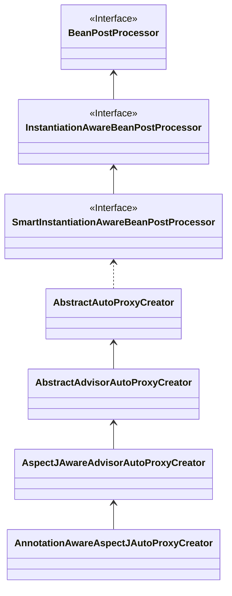

前面几篇文章已经讲完了 bean 加载的大部分核心内容，并多次提及了循环依赖这个词。本文会讲述循环依赖如何产生，Spring 是如何解决，已经当前解决方案的局限，其中涉及大家耳熟能详的三级缓存、AOP 代理等技术点。

## 循环依赖

我们知道循环依赖最简单的例子就是对象 A 和 对象 B 相互依赖注入。

```java
public class A {
	@Autowired
  private B b;
}

public class B {
  @Autowired
  private A a;
}
```

当 Spring 加载 bean 的时候，不管先加载哪一个，到注入时，都需要得到另一个 bean 的实例引用。加载 A 需要得到 B 的引用，此时去加载 B，又需要拿到 A 的引用，但是此时 A 还没创建完成，如果不做处理，这里就会陷入创建 A、B 两个实例的无限循环之中。

## 三级缓存

网上都说 Spring 解决循环依赖，主要是还是依靠三级缓存的机制，所以有必要先了解三级缓存。

在之前的博文中已经讲过，Spring 中有三级缓存：

```java
	/** Cache of singleton objects: bean name to bean instance.
	 * 一级缓存，存储单例 bean 名称和对应的最终版的 Bean 实例对象 */
	private final Map<String, Object> singletonObjects = new ConcurrentHashMap<>(256);

	/** Cache of early singleton objects: bean name to bean instance.
	 * 二级缓存，存储单例 bean 名称和对应的 Bean 的最初版本 */
	private final Map<String, Object> earlySingletonObjects = new ConcurrentHashMap<>(16);

	/** Cache of singleton factories: bean name to ObjectFactory.
	 * 三级缓存，存储单例 bean 名称和对应的 Bean 的函数式工厂对象 */
	private final Map<String, ObjectFactory<?>> singletonFactories = new HashMap<>(16);
```

* 一级缓存 singletonObjects，记录 beanName 和已完成所有初始化工作的 bean 实例的映射关系。
* 二级缓存 earlySingltonObjects，记录 beanName 和已实例化但未初始化的 bean 实例的映射关系。
* 三级缓存 singltonFactories，记录 beanName 和 bean 的 ObjectFactory 的映射关系。

实例化，是指在内存中创建了对象；初始化，是指实例化之后，进行的一些列初始化操作，这里讲初始化，包括对象属性的填充以及执行特定的初始化方法等。

所以，“翻译”一下，一级缓存存的是完成了实例化、初始化的 bean 实例，二级缓存存的是已经完成了实例化的 bean 实例。

需要注意的是，bean 创建过程中，都是先加入三级缓存，再进入二级缓存，最后进入一级缓存。

## 解决循环依赖

我们首先按照前面讲循环依赖时，新建 A、B 两个 bean，然后我们根据前面几篇博文的思路，一点点剖析。

这里首先加载 bean A，那么整体的流程图如下：


上图中，绿色为创建 A 的过程，蓝色为创建 B 的过程，可以看见，A 的创建由容器主动触发，而 B 的创建并非容器主动触发，而是因为 A 依赖了 B，当 A 要进行属性填充时，调用了 getBean() 方法创建了 B 的实例。

同样的，B 也依赖了 A，当为 B 实例进行属性填充时，会调用 getBean() 方法获取 A 的实例，但是因为 getBean() 方法会调用 getSinglton() 方法尝试获取 A 的实例，而 A 实例在此之前通过 ObjectFactory 的方式放到了第三级缓存中，所以，getSinglton() 方法会返回在之前创建的 A 实例的引用，并将 A 从三级缓存迁移到二级缓存。

```java
	protected Object getSingleton(String beanName, boolean allowEarlyReference) {
		// Quick check for existing instance without full singleton lock
		// singletonObjects，一级缓存，存储 beanName 和 bean 实例对象的映射关系
		Object singletonObject = this.singletonObjects.get(beanName);
		if (singletonObject == null
				// 目标 bean 是否还在创建中
				&& isSingletonCurrentlyInCreation(beanName)) {
			// 从二级缓存中获取 bean 实例，二级缓存中的 bean 实例一般都是还没创建完成的实例
			singletonObject = this.earlySingletonObjects.get(beanName);
			if (singletonObject == null
					// 二级缓存中依然没有，如果允许提前创建，就访问三级缓存
					&& allowEarlyReference) {
				// 单例模式同步双重校验
				synchronized (this.singletonObjects) {
					// Consistent creation of early reference within full singleton lock
					singletonObject = this.singletonObjects.get(beanName);
					if (singletonObject == null) {
						singletonObject = this.earlySingletonObjects.get(beanName);
						if (singletonObject == null) {
							ObjectFactory<?> singletonFactory = this.singletonFactories.get(beanName);
							if (singletonFactory != null) {
								// 从三级缓存中拿到 bean 的 ObjectFactory 对象，从而拿到 bean 的早期引用
								singletonObject = singletonFactory.getObject();
								// 将 bean 实例放入二级缓存
								this.earlySingletonObjects.put(beanName, singletonObject);
								// 将 beanName 和 ObjectFactory 的映射关系从三级缓存中删除
								this.singletonFactories.remove(beanName);
							}
						}
					}
				}
			}
		}
		return singletonObject;
	}
```

我们回头看看这里的 ObjectFactory 里面有什么？

从前面的流程看见，是实例化了 A 对象之后，才加入了三级缓存，代码位于 doCreateBean() 方法中，最后的 ObjectFactory 的内容对应的就是 `AbstractAutowireCapableBeanFactory#getEarlyBeanReference()` 方法。

```java
	protected Object getEarlyBeanReference(String beanName, RootBeanDefinition mbd, Object bean) {
		Object exposedObject = bean;
		if (!mbd.isSynthetic() && hasInstantiationAwareBeanPostProcessors()) {
			for (SmartInstantiationAwareBeanPostProcessor bp : getBeanPostProcessorCache().smartInstantiationAware) {
				exposedObject = bp.getEarlyBeanReference(exposedObject, beanName);
			}
		}
		return exposedObject;
	}
```

* beanName 是 bean 名称。
* mbd 是 bean 的 MergedBeanDefinition。
* bean 则是还未加载完成的 bean 实例。

中间的 if 和 for 循环可以暂时跳过，因为这部分是一些自定义扩展的逻辑，包括 Spring AOP 的逻辑，抛开这些不谈，其实就是直接返回的刚实例化好的 bean 实例，尽管还没有完成属性填充等操作，但就算最终完成了属性填充、初始化等操作，对象的引用是不会变的，所以这里拿到了对象引用就够了。

就这样，创建 B 时，也拿到了 A 的实例，虽然 A 还并不“完整”。

拿到 A 的实例之后，B 也就能正常创建完成，而创建 A 时调用的 populateBean() 方法也能正常拿到 B 的实例，A 最终也能创建完成。

到这里，思路和逻辑应该还是比较清晰的，那就继续思考一个问题：既然创建 B 时，拿 A 对象的时候，会把 A 放到从三级缓存迁移二级缓存，那为何不一开始就将 A 放在二级缓存中，这样 B 依然能正常拿到 A 的实例，这个过程中三级缓存的作用不大，换言之，这里我们我们要思考的是，**第三级缓存有什么用？**

### 第三级缓存和 AOP

> 在前面已经有单独的一篇博文详细讲过 Spring AOP: [Spring源码解析：Spring AOP](/posts/629e417006f1)。

其实网上很多博文都说过，是因为 AOP 机制的存在，才让第三级缓存变成了“必须”，我觉得这其实没错，确实和 AOP 也有关系。

还是 A、B 两个 bean 循环依赖的例子，不过 A 还多了一层 AOP 代理，我们知道 Spring 的代理方式有 JDK 动态代理和基于 Cglib 实现的动态代理，这两种代理的区别，以及动态代理和静态代理的区别，可以参考很久之前的博文：[静态代理和动态代理](/posts/b8f5ebf685e8)，这里就不再赘述。

这里只需要明确 Spring 中代理生成的对象，和被代理的对象并不是同一个对象，Spring 启动完成后，对于有代理的情况，依赖的都是代理生成的对象，而不是最原始的那个 Java 对象。

有点绕，拿前面 A、B 循环依赖的例子说明，A 多了一层 AOP 代理，那么 B 最终拿到的 A 对象其实不是上面的流程图最开始创建 A 对象的引用，而是它的代理对象 Proxy$A，让 B 拿不到真正的 A 对象，这样才能从逻辑上保证 AOP 能真正完成切面。

好的，那么接下来，基于以上的例子，就有 3 个问题要解决：

1. 问题一：B 如何拿到 A 的代理对象的？
2. 问题二：A 的创建过程中，最终放到一级缓存中的也应是代理对象，如果没有另一个 bean 依赖它，那是什么时候做了这层代理的工作，拿到代理对象？
3. 问题三：第三级缓存对 AOP 有什么必要性？

> 如果把有 AOP 的情况弄明白了，那自然就明白了没有 AOP 横插一脚的循环依赖的情况了。

#### 问题一

> 问题一：B 如何拿到 A 的代理对象的？

前面的的 A、B 初始化得了流程图中，有一个细节是没有画出来的，就是在 doGetBean() 方法执行过程中会调用 `DefaultSingletonBeanRegistry#getSingleton(String)` 方法，参数为要回去的 bean 的 beanName 该方法又会调用 `DefaultSingletonBeanRegistry#getSingleton(String, boolean)` 方法，其中第一个参数依然为 beanName，第二个参数则是决定是否允许返回 bean 的早期引用。

```java
	protected Object getSingleton(String beanName, boolean allowEarlyReference) {
		// Quick check for existing instance without full singleton lock
		// singletonObjects，一级缓存，存储 beanName 和 bean 实例对象的映射关系
		Object singletonObject = this.singletonObjects.get(beanName);
		if (singletonObject == null
				// 目标 bean 是否还在创建中
				&& isSingletonCurrentlyInCreation(beanName)) {
			// 从二级缓存中获取 bean 实例，二级缓存中的 bean 实例一般都是还没创建完成的实例
			singletonObject = this.earlySingletonObjects.get(beanName);
			if (singletonObject == null
					// 二级缓存中依然没有，如果允许提前创建，就访问三级缓存
					&& allowEarlyReference) {
				// 单例模式同步双重校验
				synchronized (this.singletonObjects) {
					// Consistent creation of early reference within full singleton lock
					singletonObject = this.singletonObjects.get(beanName);
					if (singletonObject == null) {
						singletonObject = this.earlySingletonObjects.get(beanName);
						if (singletonObject == null) {
							ObjectFactory<?> singletonFactory = this.singletonFactories.get(beanName);
							if (singletonFactory != null) {
								// 从三级缓存中拿到 bean 的 ObjectFactory 对象，从而拿到 bean 的早期引用
								singletonObject = singletonFactory.getObject();
								// 将 bean 实例放入二级缓存
								this.earlySingletonObjects.put(beanName, singletonObject);
								// 将 beanName 和 ObjectFactory 的映射关系从三级缓存中删除
								this.singletonFactories.remove(beanName);
							}
						}
					}
				}
			}
		}
		return singletonObject;
	}
```

这里我也把 A、B 两个 bean 加载的流程图再搬过来。


在 A 加载过程中，因为对 B 的依赖，触发了 B 的加载，B 加载时，又依赖 A，所以又调用了 `getBean(String)` 方法获取 A 的实例，而此时，A 的实例对象虽然已经创建，但并不在一、二级缓存中，而只是被第三级缓存中的 A 的 ObjectFactory 持有。所以上面这次 `getSingleton(String, boolean)` 的调用，会拿到 A 的 ObjectFactory 并执行其逻辑。

A 对应的 ObjectFacotry 的逻辑其实就是下面这个方法，在源码中能找到的不多说。

```java
	protected Object getEarlyBeanReference(String beanName, RootBeanDefinition mbd, Object bean) {
		Object exposedObject = bean;
		if (!mbd.isSynthetic() && hasInstantiationAwareBeanPostProcessors()) {
			for (SmartInstantiationAwareBeanPostProcessor bp : getBeanPostProcessorCache().smartInstantiationAware) {
				exposedObject = bp.getEarlyBeanReference(exposedObject, beanName);
			}
		}
		return exposedObject;
	}
```

这里从 BeanPostProcessor 的缓存中拿到了 smartInstantiationAware：

```java
	static class BeanPostProcessorCache {

		final List<InstantiationAwareBeanPostProcessor> instantiationAware = new ArrayList<>();

		final List<SmartInstantiationAwareBeanPostProcessor> smartInstantiationAware = new ArrayList<>();

		final List<DestructionAwareBeanPostProcessor> destructionAware = new ArrayList<>();

		final List<MergedBeanDefinitionPostProcessor> mergedDefinition = new ArrayList<>();
	}
```

而 SmartInstantiationAwareBeanPostProcessor 的诸多实现类，包括一个抽象实现类 AbstractAutoProxyCreator，这个抽象类又有两个实现类：AnnotationAwareAspectJAutoProxyCreator、AspectJAwareAdvisorAutoProxyCreator。

这两个实现类是 Spring AOP 的组合到 Spring 容器的关键组件。



抽象实现类 `AbstractAutoProxyCreator` ，也实现了 `getEarlyBeanReference` 方法。

```java
	@Override
	public Object getEarlyBeanReference(Object bean, String beanName) {
		Object cacheKey = getCacheKey(bean.getClass(), beanName);
		this.earlyProxyReferences.put(cacheKey, bean);
		return wrapIfNecessary(bean, beanName, cacheKey);
	}
```

前两行代码只是缓存的处理，cacheKey 要么是 beanName，要么就是 bean 的 Class。

```java
	protected Object getCacheKey(Class<?> beanClass, @Nullable String beanName) {
		if (StringUtils.hasLength(beanName)) {
			return (FactoryBean.class.isAssignableFrom(beanClass) ?
					BeanFactory.FACTORY_BEAN_PREFIX + beanName : beanName);
		}
		else {
			return beanClass;
		}
	}
```

而 `wrapIfNecessary` 方法，会有具体生成代理的逻辑，这里不再深究，可再 [Spring源码解析：Spring AOP](/posts/629e417006f1) 中深入了解。

从上面可以看出，**通过第三级缓存的 ObjectFactory 是可以拿到 bean 的代理对象的，哪怕此时 A 的 bean 对象实例没有初始化完成，但至少对象的内存引用地址不会再变了。**

#### 问题二

> 问题二：A 的创建过程中，最终放到一级缓存中的也应是代理对象，如果没有另一个 bean 依赖它，那是什么时候做了这层代理的工作，拿到代理对象？

这个其实在前面的流程图中的最后一步，执行 A 的初始化逻辑时发生的，具体的入口就是在 doCreateBean() 方法中，调用了 initializeBean() 方法。

```java
	protected Object initializeBean(String beanName, Object bean, @Nullable RootBeanDefinition mbd) {
		if (System.getSecurityManager() != null) {
			AccessController.doPrivileged((PrivilegedAction<Object>) () -> {
				invokeAwareMethods(beanName, bean);
				return null;
			}, getAccessControlContext());
		}
		else {
			invokeAwareMethods(beanName, bean);
		}

		Object wrappedBean = bean;
		if (mbd == null || !mbd.isSynthetic()) {
			// 执行 init-method 之前的前处理器
			wrappedBean = applyBeanPostProcessorsBeforeInitialization(wrappedBean, beanName);
		}

		try {
			// 执行 init-method 方法
			invokeInitMethods(beanName, wrappedBean, mbd);
		}
		catch (Throwable ex) {
			throw new BeanCreationException(
					(mbd != null ? mbd.getResourceDescription() : null),
					beanName, "Invocation of init method failed", ex);
		}
		if (mbd == null || !mbd.isSynthetic()) {
			// 执行 init-method 后处理器
			wrappedBean = applyBeanPostProcessorsAfterInitialization(wrappedBean, beanName);
		}

		return wrappedBean;
	}
```

这段逻辑里面，参数 bean 就是实例化后的 bean 对象实例，然后再执行以下 3 步：

1. 初始化前，调用 applyBeanPostProcessorsBeforeInitialization() 方法，执行 `BeanPostProcessor#postProcessBeforeInitialization()` 方法（但 AOP 的逻辑没在这一步）。
2. 执行初始化方法，比如执行配置文件执行的 init-method。
3. 初始化后，调用 applyBeanPostProcessorsAfterInitialization() 反复噶，执行 `BeanPostProcessor#postProcessAfterInitialization()` 方法，这里才有 AOP 的处理逻辑。

所以这里我们只关注第 3 步，查看 AnnotationAwareAspectJAutoProxyCreator、AspectJAwareAdvisorAutoProxyCreator 的类继承接口，可以看见，在这一步，执行的是它们的父类的方法：`AbstractAutoProxyCreator#postProcessAfterInitialization(Object, String)`。

```java
	public Object postProcessAfterInitialization(@Nullable Object bean, String beanName) {
		if (bean != null) {
			Object cacheKey = getCacheKey(bean.getClass(), beanName);
			if (this.earlyProxyReferences.remove(cacheKey) != bean) {
				return wrapIfNecessary(bean, beanName, cacheKey);
			}
		}
		return bean;
	}
```

然后又看见了熟悉的 `wrapIfNecessary()` 方法，所以这里其实也能拿到代理对象。

不过，这里代码虽然短，但是背后的逻辑比较复杂：

1. 如果不曾有 B 或者其他 bean 依赖 A，那么到上述逻辑时，势必会调用到 wrapIfNecessary() 方法中，创建 A 的代理对象并返回。
2. 如果有 B 或者其他 bean 依赖 A，那么到这里时，要么是 A 已经创建了代理对象，则直接返回 bean，要么就是还没有创建，则直接创建代理对象并返回。

如果直接返回 bean，那表明再次之前，代理对象已经创建，那也只能是因为其他 bean 的依赖而创建，那么此时最终会暴露出来的 A 的 bean 实例，其实是前面第一个问题中调用 getSingleton(String) 方法时，就已经进入了二级缓存的代理对象。

当 `initializeBean()` 方法执行完成后，还会调用一次 getSingleton(String, boolean) 方法，只不过第二个参数传入的是 false，也就是说只能第一、二级缓存中获取实例，而对于 A 再调用 `initializeBean()` 方法前就已经创建了代理对象的情况，则肯定是能在第二级缓存中拿到代理对象的。

那么，到这里就能发现，不管哪种方式，其实都能拿到代理对象，最终放入一级缓存中。

#### 问题三

> 问题三：第三级缓存对 AOP 有什么必要性？

这里的必要性，我认为，其实是因为解决循环依赖时，如果没有第三级缓存，在还有 AOP 的情况下，是没办法拿到还在加载中的 bean 的代理对象的，因为第二级和第一级缓存中对象的区别只是是否完成了初始化工作，但实际上确实同一个内存地址引用，而 AOP 处理过后的代理对象，和原来的对象，已经连内存地址引用都不是同一个。

## 循环依赖解决方案的局限性

从前面的流程图，以及各种逻辑细节的讨论中，我们会发现，循环依赖的解决，主要是依赖于 bean 的加载过程中允许获取早期引用，即拿到一个业务上非完整的对象引用，换句话说，需要 new 这个关键字的逻辑执行完之后，才有这个早期引用。

而如果是通过构造函数初始化，且循环依赖的 bean 还恰好和这个构造函数相关联，以前面的例子来看，就会出现 A 实例还未创建就触发了 B 的创建，而 B 依赖 A，又会获取 A 的早期实例，但是此时 A 实例化都还没有完成，从而导致局面僵死。

## 总结

1. Spring 循环依赖的解决方案，依赖于 Spring 的三级缓存机制。
2. 该解决方案，不适用于构造函数上的循环依赖。
3. Spring 的第三级缓存，对于解决有 AOP 代理穿插其中的循环依赖，是必要的，因为能通过第三级缓存拿到依赖 bean 的代理对象。

## 参考文档

* [Spring源码解析：Spring AOP](/posts/629e417006f1) 
