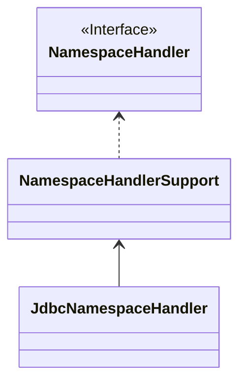

在上一篇讲解 BeanDefinition 的解析过程中，不止一次遇见了自定义标签的解析，且都伴随着一个自定义的命名空间。

在 `DefaultBeanDefinitionDocumentReader#parseBeanDefinitions` 方法中，便有 spring 默认命名空间和自定义命名空间的区分处理。

```java
	protected void parseBeanDefinitions(Element root, BeanDefinitionParserDelegate delegate) {
		// 是否是 spring 默认的命名空间
		if (delegate.isDefaultNamespace(root)) {
			// 获取子节点列表
			NodeList nl = root.getChildNodes();
			for (int i = 0; i < nl.getLength(); i++) {
				Node node = nl.item(i);
				if (node instanceof Element) {
					Element ele = (Element) node;
					// 子节点是否是默认命名空间中的标签
					if (delegate.isDefaultNamespace(ele)) {
						// 解析默认标签节点
						parseDefaultElement(ele, delegate);
					}
					else {
						// 自定义标签解析
						delegate.parseCustomElement(ele);
					}
				}
			}
		}
		else {
			// 解析自定义标签
			delegate.parseCustomElement(root);
		}
	}
```

上面的具体逻辑不再赘述，直接深入看看自定义标签的解析，即 `delegate#parseCustomElement()` 方法。深入方法实现，最终调用到同名的方法中。

```java
	public BeanDefinition parseCustomElement(Element ele, @Nullable BeanDefinition containingBd) {
		// 1.获取命名空间的 uri
		String namespaceUri = getNamespaceURI(ele);
		// 2.命名空间的 uri 不存在，则直接返回
		if (namespaceUri == null) {
			return null;
		}
		// 3.通过命名空间的 uri 获取对应的处理器
		NamespaceHandler handler = this.readerContext.getNamespaceHandlerResolver().resolve(namespaceUri);
		if (handler == null) {
			// 4.如果没有相应的处理器，记录错误，并返回
			error("Unable to locate Spring NamespaceHandler for XML schema namespace [" + namespaceUri + "]", ele);
			return null;
		}
		// 5.调用处理器的parse方法进行解析
		return handler.parse(ele, new ParserContext(this.readerContext, this, containingBd));
	}
```

这里的核心逻辑就是，从 readerContext 中获取 NamespaceHandlerResolver，然后通过 namespaceUri 获取一个 NamespaceHandler，然后调用 `NamespaceHandler#parse` 方法对自定义标签进行解析。

## NamespaceHandlerResolver

追溯代码会发现，readerContext 中的 NamespaceHandlerResolver 实例是 DefaultNamespaceHandlerResolver，再看看 `DefaultNamespaceHandlerResolver#resolve` 方法。

```java
	// 默认 handlerMapping 配置文件地址
	public static final String DEFAULT_HANDLER_MAPPINGS_LOCATION = "META-INF/spring.handlers";
	public NamespaceHandler resolve(String namespaceUri) {
		// 获取命名空间 uri 和对应解析器的 Map
		Map<String, Object> handlerMappings = getHandlerMappings();
		// 获取解析器对象或者 class 名称
		Object handlerOrClassName = handlerMappings.get(namespaceUri);
		if (handlerOrClassName == null) {
			return null;
		}
		else if (handlerOrClassName instanceof NamespaceHandler) {
			// 如果是 NamespaceHandler 对象，直接返回
			return (NamespaceHandler) handlerOrClassName;
		}
		else {
			String className = (String) handlerOrClassName;
			try {
				// 加载 class
				Class<?> handlerClass = ClassUtils.forName(className, this.classLoader);
				if (!NamespaceHandler.class.isAssignableFrom(handlerClass)) {
					throw new FatalBeanException("Class [" + className + "] for namespace [" + namespaceUri +
							"] does not implement the [" + NamespaceHandler.class.getName() + "] interface");
				}
				// 初始化对象
				NamespaceHandler namespaceHandler = (NamespaceHandler) BeanUtils.instantiateClass(handlerClass);
				// 初始化
				namespaceHandler.init();
				// 放入缓存的 map 中
				handlerMappings.put(namespaceUri, namespaceHandler);
				return namespaceHandler;
			}
			catch (ClassNotFoundException ex) {
				throw new FatalBeanException("Could not find NamespaceHandler class [" + className +
						"] for namespace [" + namespaceUri + "]", ex);
			}
			catch (LinkageError err) {
				throw new FatalBeanException("Unresolvable class definition for NamespaceHandler class [" +
						className + "] for namespace [" + namespaceUri + "]", err);
			}
		}
	}
```

1. 首先获取了一个 handlerMappings 的 map，key 是 namespaceUri，value 是对应的 NameSpaceHandler 对象或 Class 名称。
2. 通过 namespaceUri 从 map 中获取 NameSpaceHandler.
3. 如果为空，直接结束。
4. 如果不为空，且是 NamespaceHandler 对象，直接将对象返回。
5. 如果不为空，且不是 NamespaceHandler 对象实例，则默认当成 Class name 处理，则加载对应的 Class，然后实例化，放到 handlerMappings 中，并返回实例化的对象。

在第一步中，直接就获取了一个 handlerMappings，这东西是哪里来的呢？

```java
	private Map<String, Object> getHandlerMappings() {
		// 初始化 Map
		Map<String, Object> handlerMappings = this.handlerMappings;
		if (handlerMappings == null) {
			// 同步代码块加锁，防止并发操作
			synchronized (this) {
				handlerMappings = this.handlerMappings;
				if (handlerMappings == null) {
					if (logger.isTraceEnabled()) {
						logger.trace("Loading NamespaceHandler mappings from [" + this.handlerMappingsLocation + "]");
					}
					try {
						// 加载 properties 文件
						Properties mappings =
								PropertiesLoaderUtils.loadAllProperties(this.handlerMappingsLocation, this.classLoader);
						if (logger.isTraceEnabled()) {
							logger.trace("Loaded NamespaceHandler mappings: " + mappings);
						}
						// 将解析结果放到 map 中
						handlerMappings = new ConcurrentHashMap<>(mappings.size());
						CollectionUtils.mergePropertiesIntoMap(mappings, handlerMappings);
						this.handlerMappings = handlerMappings;
					}
					catch (IOException ex) {
						throw new IllegalStateException(
								"Unable to load NamespaceHandler mappings from location [" + this.handlerMappingsLocation + "]", ex);
					}
				}
			}
		}
		return handlerMappings;
	}
```

这里的核心在于，handlerMappings 是从 hanlderMappingLocation 这个地方的资源文件中加载出来的。

DefaultNamespaceHandlerResolver 中的 handlerMappingLocation 默认是 `META-INF/spring.handlers`。

在 spring 源码中随便找一个 spring.handlers 文件一探究竟。

```
http\://www.springframework.org/schema/jdbc=org.springframework.jdbc.config.JdbcNamespaceHandler
```

上面是 spring-jdbc 模块的 spring.handlers，同时我们也可以知道，spring 家族本身原生的模块，其实也是以自定义标签的形式进行继承的。

## NamespaceHandler

拿到嘞 NamespaceHandler 之后，就是自定义标签具体的解析流程了，就医 JdbcNamespaceHandler 为例。

JdbcNamespaceHandler 并非直接实现 NamespaceHandler 接口，而是继承了 `NamespaceHandlerSupport` 抽象类。



而 JdbcNamespaceHandler 本身也只是注册了不同标签的不同解析处理器。

```java
public class JdbcNamespaceHandler extends NamespaceHandlerSupport {

	@Override
	public void init() {
		registerBeanDefinitionParser("embedded-database", new EmbeddedDatabaseBeanDefinitionParser());
		registerBeanDefinitionParser("initialize-database", new InitializeDatabaseBeanDefinitionParser());
	}
}
```

```java
public abstract class NamespaceHandlerSupport implements Namespacehandler {
	
  private final Map<String, BeanDefinitionParser> parsers = new HashMap<>();
	
  protected final void registerBeanDefinitionParser(String elementName, BeanDefinitionParser parser) {
		this.parsers.put(elementName, parser);
	}
  
}
```

这里注册了两个标签对应的解析处理器，是 BeanDefinitionParser 接口的不同实现。

再看看 NamespaceHandlerSupport 中的 parse 方法：

```java
	public BeanDefinition parse(Element element, ParserContext parserContext) {
		// 获取解析器
		BeanDefinitionParser parser = findParserForElement(element, parserContext);
		// 解析
		return (parser != null ? parser.parse(element, parserContext) : null);
	}

	private BeanDefinitionParser findParserForElement(Element element, ParserContext parserContext) {
		// 比如 bean 配置文件中开启事务的注解支持时使用 <tx:annotation-driven>，在这里拿到的 localName 就是 annotation-driven
		String localName = parserContext.getDelegate().getLocalName(element);
		// 通过 localName 获取对应的解析器
		BeanDefinitionParser parser = this.parsers.get(localName);
		if (parser == null) {
			parserContext.getReaderContext().fatal(
					"Cannot locate BeanDefinitionParser for element [" + localName + "]", element);
		}
		return parser;
	}
```

到这里其实就比较明了，其实就是解析出标签的标签名，然后得到标签名对应的处理器，然后直接进行解析得到 BeanDefinition 即可。

## 总结

* NamespaceHandlerResolver 维护命名空间和对应的 NamespaceHandler 的映射关系，默认的映射关系配置文件在 `META-INF/spring.handlers`。
* NamespaceHandler 负责名空间中的各个标签的具体解析逻辑。
