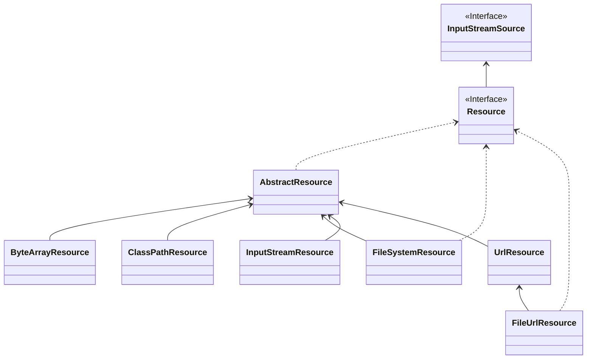
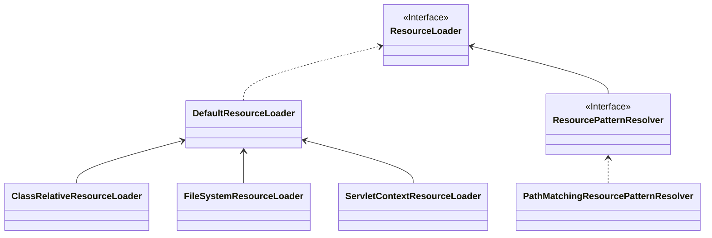

Spring 中的资源抽象为 Resource 接口，对应的加载器为 ResourceLoader 接口。

## Resource

```java
public interface Resource extends InputStreamSource {

	/**
	 * 判断文件是否存在
	 */
	boolean exists();

	/**
	 * 表示资源是否可以通过 getInputStream() 读取非空内容
	 */
	default boolean isReadable() {
		return exists();
	}

	/**
	 * 表示资源是否能获取一个 open 流
	 */
	default boolean isOpen() {
		return false;
	}

	/**
	 * 资源是否为文件系统中的文件类型
	 */
	default boolean isFile() {
		return false;
	}

	/**
	 * 返回资源的 URL 句柄
	 */
	URL getURL() throws IOException;

	/**
	 * 返回资源的 URI 句柄
	 */
	URI getURI() throws IOException;

	/**
	 * 获取资源的文件句柄
	 */
	File getFile() throws IOException;

	/**
	 * 获取一个 ReadableByteChannel
	 */
	default ReadableByteChannel readableChannel() throws IOException {
		return Channels.newChannel(getInputStream());
	}

	/**
	 * Determine the content length for this resource.
	 * @throws IOException if the resource cannot be resolved
	 * (in the file system or as some other known physical resource type)
	 */
	long contentLength() throws IOException;

	/**
	 * 获取最后一次修改的时间戳
	 */
	long lastModified() throws IOException;

	/**
	 * 根据资源相对路径创建资源
	 */
	Resource createRelative(String relativePath) throws IOException;

	/**
	 * 获取文件名
	 */
	@Nullable
	String getFilename();

	/**
	 * 获取资源描述
	 */
	String getDescription();

}

```

Resource 类图如下：



Resource 根据不同的资源类型，提供了不同的资源实现类。

* AbstractResource

  Resource 接口默认的抽象实现，实现了大部分的 Resource 中的方法，如果要新增新的资源类型，需要实现 AbstractResource 类，而不是实现 Resource 接口。

* FileSystemResource

  对 File 类型资源的封装，且实现了 WritableResource 接口。在 Spring 5.0 开始，通过 NIO.2 的 API 进行读写交互，在 Spring 5.1 开始，可能是使用 java.mio.file.Path 进行构造，这种情况下，都是通过 NIO.2 进行交互，除了通过 getFile() 方法获取 File 对象。

* ByteArrayResource

  对字节数组的资源进行封装。

* UrlResource

  对 java.net.URL 类型资源进行封装。

* ClassPathResource

  对 classpath 类型的资源进行封装，使用给定的 Classloader 或者给定的 Class 加载资源。

* InputStreamResource

  对给定的 InputStream 进行封装。

## ResourceLoader

```java
public interface ResourceLoader {

	/** Pseudo URL prefix for loading from the class path: "classpath:". */
	String CLASSPATH_URL_PREFIX = ResourceUtils.CLASSPATH_URL_PREFIX;


	/**
	 * 根据文件位置获取对应的 Resource 对象
	 */
	Resource getResource(String location);

	/**
	 * 返回该 ResourceLoader 所使用的 ClassLoader
	 */
	@Nullable
	ClassLoader getClassLoader();

}
```



先前已经讲过，ResourceLoader 接口提供了加载资源的能力，不同的资源类型对应不同的 ResourceLoader 实现类。

### DefaultResourceLoader

ResourceLoader 接口有默认实现类 DefaultResourceLoader。

先看看 DefaultResourceLoader.getResource() 方法：

```java
	public Resource getResource(String location) {
		Assert.notNull(location, "Location must not be null");
		/*
		 * 提供 ProtocolResolver 接口进行扩展，自定义获取资源的逻辑
		 */
		for (ProtocolResolver protocolResolver : getProtocolResolvers()) {
			Resource resource = protocolResolver.resolve(location, this);
			if (resource != null) {
				return resource;
			}
		}
		/*
		* 对于以 / 开头的文件地址，返回 ClassPathContextResource
		*/
		if (location.startsWith("/")) {
			return getResourceByPath(location);
		}
		else if (location.startsWith(CLASSPATH_URL_PREFIX)) {
			/*
			* 对于以 classpath: 开头的文件地址，返回 ClassPathResource
			*/
			return new ClassPathResource(location.substring(CLASSPATH_URL_PREFIX.length()), getClassLoader());
		}
		else {
			try {
				// Try to parse the location as a URL...
				/* 尝试将地址当成 URL 进行处理 */
				URL url = new URL(location);
				/* 如果是文件协议，则返回 FileUrlResource，否则返回 UrlResource */
				return (ResourceUtils.isFileURL(url) ? new FileUrlResource(url) : new UrlResource(url));
			}
			catch (MalformedURLException ex) {
				// No URL -> resolve as resource path.
				// 如果当成 url 也无法解析，则默认返回 ClassPathContextResource
				return getResourceByPath(location);
			}
		}
	}
```

DefaultResourceLoader 是默认的 ResourceLoader 实现类，同时也支持了多种地址格式的加载。

需要注意的是对于想要自定义 Resource 加载逻辑的情况，并不需要再去实现 ResourceLoader 接口，而是实现 `ProtocolResolver` 接口来进行扩展，然后调用`DefaultResourceLoader.addProtocolResolver(ProtocolResolver resolver)` 方法进行注册。

```java
@FunctionalInterface
public interface ProtocolResolver {
	@Nullable
	Resource resolve(String location, ResourceLoader resourceLoader);
}
```

以及，比较奇怪的点是当路径以 `/` 开头时，返回的是 ClassPathContextResource，这个时候难道不应该是一个 FileSystemContextResource 吗？

所以，还提供了 FileSystemResourceLoader 类。

### FileSystemResourceLoader

FileSystemResourceLoader 继承 DefaultResourceLoader 类，重写了 getResourceByPath() 方法。

```java
	@Override
	protected Resource getResourceByPath(String path) {
		if (path.startsWith("/")) {
			path = path.substring(1);
		}
		return new FileSystemContextResource(path);
	}
```

这里返回的不是 FileSystemResource，而是其子类 FileSystemContextResource，因为 FileSystemContextResource 实现了 ContextResource 的 getPathWithinContext() 方法用来返回资源位置。

```java
		@Override
		public String getPathWithinContext() {
			return getPath();
		}
```

> 说实话我不知道实现这个有啥用。

### PathMatchingResourcePatternResolver

我们查看 ClassPathXmlApplicationContext 的源码会发现，它初始化的时候，并不是直接使用了 DefaultResourceLoader 类，而是初始化的 `PathMatchingResourcePatternResolver` 类，在构建 PathMatchingResourcePatternResolver 时又直接初始化了一个 DefaultResourceLoader：

```java
	public PathMatchingResourcePatternResolver() {
		this.resourceLoader = new DefaultResourceLoader();
	}
```

而 PathMatchingResourcePatternResolver 实现了 ResourcePatternResolver 接口，ResourcePatternResolver 接口继承了 ResourceLoader 接口，只是在 ResourceLoader 接口基础上增加了返回一个 Resource 数组的方法：

```java
public interface ResourcePatternResolver extends ResourceLoader {

	/**
	 * 从这里就可以知道对 classpath*: 这种写法的支持，就是由 ResourcePatternResolver 提供的。
	 */
	String CLASSPATH_ALL_URL_PREFIX = "classpath*:";

	/**
	 * 根据 locationPattern 进行匹配获取 Resource 数组
	 */
	Resource[] getResources(String locationPattern) throws IOException;

}
```

然后再看看 PathMatchingResourcePatternResolver 如何实现 getResources(String locationPattern) 方法。

```java
	public Resource[] getResources(String locationPattern) throws IOException {
		Assert.notNull(locationPattern, "Location pattern must not be null");
		// 判断 locationPattern 是否以 classpath*: 开头
		if (locationPattern.startsWith(CLASSPATH_ALL_URL_PREFIX)) {
			// 判断是否为 classpath resource（也可能存在多个同名文件）
			// PathMatcher 默认为 AntPathMatcher，支持 ant 风格
			if (getPathMatcher().isPattern(locationPattern.substring(CLASSPATH_ALL_URL_PREFIX.length()))) {
				// a class path resource pattern
				return findPathMatchingResources(locationPattern);
			}
			else {
				// all class path resources with the given name
				return findAllClassPathResources(locationPattern.substring(CLASSPATH_ALL_URL_PREFIX.length()));
			}
		}
		else {
			// Generally only look for a pattern after a prefix here,
			// and on Tomcat only after the "*/" separator for its "war:" protocol.
			int prefixEnd = (locationPattern.startsWith("war:") ? locationPattern.indexOf("*/") + 1 :
					locationPattern.indexOf(':') + 1);
			if (getPathMatcher().isPattern(locationPattern.substring(prefixEnd))) {
				return findPathMatchingResources(locationPattern);
			}
			else {
				// 对于不是 classpath*: 开头且不以 war 开头，还不包含 * 和 {} 的路径，采直接使用默认加载器加载单个资源文件
				// 这里的默认加载器是初始化PathMatchingResourcePatternResolver时指定的，如果未指定则是 DefaultResourceLoader
				return new Resource[] {getResourceLoader().getResource(locationPattern)};
			}
		}
	}
```

这里 getPathMatcher() 默认返回的是 AntPathMatcher，也是通过 AntPathMatcher 支持 ant 风格的路径。

